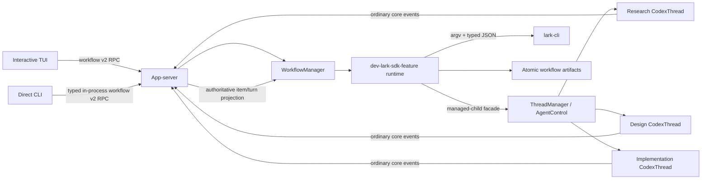

# `dev-lark-sdk-feature` Workflow Design

**Date:** 2026-07-16  
**Status:** Design approved; listener/ownership/shutdown safety amendments pending plan approval
**Repository:** `codex/`  
**Target repository:** `/Users/bytedance/project/lark-client-ai-know-bugfix/rust-sdk`

## 1. Summary

Add a production Codex workflow named `dev-lark-sdk-feature`. Users start it from either the
interactive TUI:

```text
/workflow dev-lark-sdk-feature --developers <comma-separated-open-ids> [--artifacts-dir <relative-path>]
```

or the direct CLI:

```bash
codex workflow dev-lark-sdk-feature \
  --developers <comma-separated-open-ids> \
  [--artifacts-dir <relative-path>]
```

The workflow validates the Lark Rust SDK repository, obtains one explicit confirmation before any
Lark write, creates a Lark group, and then runs three real Codex child threads:

1. requirement understanding and code research;
2. technical-design authoring and revision;
3. test-driven implementation.

The first eligible, developer-authored, bot-mentioned Lark message is the requirement. Research
continues sequentially in the same child thread until an eligible `/finish` command. The design
child then produces a technical design and accepts revision feedback until an eligible
`/approve-design` command records approval of the exact design digest. Only then may the
implementation child start.

The workflow does not implement a separate agent loop. Child work enters the ordinary core path:
`Op::UserInput` -> submission loop -> `RegularTask` -> `run_turn` -> model/tool sampling loop ->
rollout events and persistence. The app-server remains the sole consumer of each `CodexThread`
event receiver and projects authoritative completed assistant items to the workflow runtime.

## 2. Goals

- Provide one shared typed invocation model for TUI and CLI.
- Validate the repository and artifact path before creating artifacts, threads, or Lark side
  effects.
- Require one scope confirmation before the first Lark write and a separate in-chat approval of the
  generated technical design before implementation.
- Use bot identity for all Lark operations and typed JSON at an injectable process boundary.
- Keep every workflow stage inside real parent/child Codex thread, turn, event, persistence, and
  cancellation machinery.
- Preserve the parent/child graph and existing TUI child navigation.
- Persist crash-safe workflow state without persisting credentials.
- Make explicit retriggering safe after interruption without exposing a public resume flag.
- Provide focused, deterministic tests that perform no real Lark writes.

## 3. Non-goals

- A general-purpose workflow framework or workflow-definition language.
- Adding Lark orchestration to `codex-core`.
- Exposing the crate-private `Session` or task helpers as general public APIs.
- Replacing ordinary model, tool, approval, sandbox, rollout, or thread behavior.
- Automatically resuming workflows at Codex startup.
- Automatically deleting a Lark group after completion, failure, or cancellation.
- Supporting this workflow through the official TUI's explicit remote-workspace target.
- Treating one visible Codex turn as one model request.
- Making automated tests depend on real Lark, credentials, or the private design-template document.

## 4. Verified Current Architecture

The following statements describe the current implementation and constrain the design.

### 4.1 TUI and app-server boundary

- No-subcommand CLI dispatch starts the TUI. The TUI selects `Embedded`, `LocalDaemon`, or
  `Remote` internally in `codex-rs/tui/src/lib.rs:260-279` and `:799-846`.
- Embedded uses the typed in-process app-server client. Local daemon and explicit remote use the
  remote app-server client, but local daemon retains local-workspace semantics.
- Both JSON and typed in-process requests enter the same `MessageProcessor` dispatch in
  `codex-rs/app-server/src/message_processor.rs:516-860`.
- The in-process client detaches request futures while continuing to drain notifications in
  `codex-rs/app-server-client/src/lib.rs:453-482`. Dropping a client request therefore does not
  cancel server work.

### 4.2 Thread and child lifecycle

- `ThreadManager` owns the live-thread registry and public thread lifecycle API in
  `codex-rs/core/src/thread_manager.rs:182`.
- `CodexThread` is the public handle around the active `Codex` runtime and exposes submission and
  event APIs in `codex-rs/core/src/codex_thread.rs:162-421`.
- Public `ThreadManager::spawn_subagent` at `codex-rs/core/src/thread_manager.rs:725` is a
  fork-oriented convenience
  path. The managed parent/child path that reuses the parent's `AgentControl`, agent graph,
  capacity accounting, lineage metadata, and notifications is currently crate-private:
  `AgentControl::spawn_agent_with_metadata` and `spawn_agent_internal` in
  `codex-rs/core/src/agent/control/spawn.rs:117-415`.
- Child discoverability after reconnect depends on `SessionSource::SubAgent(ThreadSpawn { ... })`;
  the TUI backfills that lineage in `codex-rs/tui/src/app/loaded_threads.rs:1-114`.

### 4.3 Submission, turn, and event lifecycle

- `CodexThread::submit_user_input_with_client_user_message_id` in
  `codex-rs/core/src/codex_thread.rs:262-276` feeds the existing submission path and preserves a
  caller-provided stable user-message identity.
- A session has at most one active task. Active-turn state and task cancellation are maintained in
  `codex-rs/core/src/state/turn.rs:29-83` and `codex-rs/core/src/tasks/mod.rs:325-560`.
- One user-visible turn can perform multiple internal model sampling steps. Tool output is recorded
  and the same turn samples again through the ordinary `run_turn` loop.
- `CodexThread::next_event` delegates to a single receiver in
  `codex-rs/core/src/codex_thread.rs:420-421`; it is not a broadcast stream.
- The app-server thread listener is the existing sole consumer at
  `codex-rs/app-server/src/request_processors/thread_lifecycle.rs:289-325`.
- The authoritative final assistant body arrives in a completed `TurnItem::AgentMessage` and is
  projected as `item/completed` in
  `codex-rs/app-server/src/bespoke_event_handling.rs:980-989,1369-1382`.
- `turn/completed` is terminal metadata and does not contain those completed items; its projection
  is built at `codex-rs/app-server/src/bespoke_event_handling.rs:1228-1244`.

### 4.4 App-server delivery

- Request and notification definitions are generated from macros in
  `codex-rs/app-server-protocol/src/protocol/common.rs:198-365,472-1129,1367-1666`.
- `ThreadScopedOutgoingMessageSender` snapshots its subscriber list at construction in
  `codex-rs/app-server/src/outgoing_message.rs:108-169`.
- The normal thread listener resolves current subscribers for every event at
  `codex-rs/app-server/src/request_processors/thread_lifecycle.rs:322-330`.
- The in-process transport intentionally treats some progress as lossy while protecting terminal
  and transcript-critical notifications in `codex-rs/app-server/src/in_process.rs:105-111` and
  `codex-rs/app-server-client/src/lib.rs:131-151`.

These facts rule out a workflow-owned clone of `next_event`, a parallel sampling loop, unrelated
top-level stage threads, or terminal-event summaries as the assistant-output source.

## 5. Chosen Architecture

### 5.1 Component boundary

Introduce a focused workspace crate:

```text
codex-rs/dev-lark-sdk-feature/
```

with Cargo package name `codex-dev-lark-sdk-feature`. It owns workflow-specific parsing,
validation, state transitions, manifest persistence, Lark process execution, prompt rendering,
and orchestration. It is not a generic workflow engine.

The app-server owns the live `WorkflowManager` instance and provides adapters for:

- managed child-thread creation;
- authoritative turn completion tracking;
- root-thread subscriber projection;
- app-server protocol requests and notifications.

`codex-core` receives only a narrow managed-child façade needed to reuse its existing internal
multi-agent lifecycle. The TUI and direct CLI remain clients of app-server requests and never own
workflow runtime state.



### 5.2 Proposed principal types

Names in this subsection are proposed APIs, not current types.

| Type | Owner | Responsibility |
|---|---|---|
| `WorkflowInvocationArgs` | workflow crate | Shared Clap parser used by TUI and CLI. |
| `DevLarkSdkFeatureArgs` | workflow crate | Raw typed arguments before repository-bound validation. |
| `DevLarkSdkFeatureConfig` | workflow crate | Canonical repository, normalized developers, safe artifact path. |
| `PreparedWorkflow` | app-server manager | One-use, expiring, read-only preparation and confirmation data. |
| `WorkflowManager` | app-server | Prepared/running registry, locks, cancellation roots, terminal guards. |
| `WorkflowRuntime` | workflow crate | One run's stage machine and durable checkpoints. |
| `WorkflowManifest` | workflow crate | Versioned, non-secret durable run state. |
| `ManifestStore` | workflow crate | Atomic reads/writes and artifact layout. |
| `RunStateCommitter` | workflow crate | Sole per-run serializer for state, sequence, stage presentations, bounded journal, and durable manifest writes. |
| `LarkCommandRunner` | workflow crate | Injectable argv-based, cancellation-aware process boundary. |
| `LarkClient<R>` | workflow crate | Typed group, member, polling, and send operations over a runner. |
| `WorkflowCodexHost` | workflow crate/app-server adapter | Feature-specific port for root/child creation, submission, lookup, waiting, interruption, and shutdown. |
| `ManagedChildSpec` | core public façade | Stage working directory, lineage, instruction overrides, and immutable workflow correlation; it does not submit input. |
| `ManagedChildHandle` | core public façade | Durably correlated child thread ID and agent path returned before the initial turn starts. |
| `WorkflowTurnTracker` | app-server | Waiters and bounded terminal cache fed by the sole thread listener. |
| `WorkflowThreadLeaseRegistry` | app-server | Pins the root and active stage child against subscriberless idle unloading. |
| `WorkflowThreadMutationPolicy` | app-server | Uses immutable stage correlation to reject external model/context/task mutations while preserving workflow-owned submission and ordinary approval responses. |
| `WorkflowProgressSink` | app-server adapter | Projects only immutable updates already committed by `RunStateCommitter`. |

`WorkflowCodexHost` is a feature-specific dependency-inversion boundary, not a generic workflow
framework. The app-server implementation delegates to `ThreadManager`, the turn tracker, and the
lease registry; the workflow crate never consumes `CodexThread::next_event` itself.

Protocol DTOs remain in `codex-app-server-protocol` and convert explicitly to/from runtime types.
They do not own locks, `Arc<CodexThread>`, cancellation tokens, command runners, or stores.

## 6. Invocation and Validation

### 6.1 Shared parser

The workflow crate provides one Clap-derived invocation parser and subcommand enum. The direct CLI
embeds the same subcommand type under `codex workflow`. The TUI uses its existing slash parser to
extract the untouched remainder, splits it with a shell-lexing library, and invokes the same Clap
parser. The shared token parser accepts tokens after `/workflow` or `codex workflow` and prepends a
synthetic program name before `clap::Parser::try_parse_from`, so the leading
`dev-lark-sdk-feature` token is not consumed as argv[0]. No shell executes the parsed string.

Supported arguments:

```text
dev-lark-sdk-feature
  --developers <comma-separated-open-ids>
  [--artifacts-dir <relative-path>]
```

Validation rules:

- `--developers` is required.
- Surrounding ASCII whitespace around comma-separated values is trimmed.
- Each normalized value matches `^ou_[A-Za-z0-9]{1,128}$`.
- Empty entries, duplicate IDs, malformed IDs, and more than 50 developers are rejected.
- Input order is retained for presentation; normalized equality is used for duplicate detection.
- `--artifacts-dir` defaults to `dev-lark-sdk-feature`.
- Raw values are never interpolated into a shell command.

The app-server repeats semantic validation after DTO conversion. Client-side parsing is usability,
not a trust boundary.

### 6.2 Repository identity

Before artifacts, threads, or any Lark write, the server:

1. canonicalizes the supplied/current working directory;
2. verifies that it is the repository root rather than accepting a basename match;
3. parses the root Cargo workspace and verifies stable members/packages including
   `lark-integrator`, `lark-api-chat`, and `lark-biz-chat`;
4. verifies the repository's root `AGENTS.md` and `.ai_knowledge/architecture.md` markers;
5. returns a typed `WrongRepository` error when any required marker is absent or inconsistent.

The validator does not reject a dirty SDK worktree. The implementation child records the initial
worktree state and must preserve unrelated changes.

### 6.3 Artifact path safety

The path validator rejects:

- absolute paths;
- empty normalized paths;
- `..` components that escape the repository;
- an existing symlink whose canonical target escapes the repository;
- a missing descendant beneath an existing symlink that escapes the repository.

Before confirmation, it canonicalizes the deepest existing ancestor and validates the proposed
suffix without creating it. After confirmation, it creates the directory and revalidates the final
canonical path before a Lark write.

## 7. Preparation and External-Side-Effect Confirmation

`workflow/prepare` is read-only. It validates arguments, repository identity, artifact-path safety,
server-local path accessibility, and `lark-cli auth status --json`. It does not create a root
thread, create artifacts, acquire durable run locks, create a group, or send a message. The
official TUI rejects its private explicit-`Remote` target before calling prepare because that
client-only distinction cannot be established securely by app-server.

The response contains a short-lived, one-use opaque `preparationId` bound to:

- the normalized invocation;
- canonical repository path;
- optional existing parent thread ID;
- current app-server instance;
- bot application identity from read-only auth status;
- expiry time, fixed at ten minutes after issue.

The exact confirmation contains:

- group name `lark-sdk需求开发`;
- the normalized developer open IDs;
- bot application identity/profile;
- canonical repository and artifact directory;
- an explicit statement that agent outputs will be forwarded to the group.

TUI uses a `SelectionViewParams` confirmation with cancel first and start second, following the
archive/delete pattern in `codex-rs/tui/src/chatwidget/slash_dispatch.rs:176-232`. CLI prompts on a
TTY. Rejection ends without a root thread, artifacts, group, or message created by this workflow.
Non-interactive CLI input without an existing repository-approved confirmation mechanism fails
closed.

`preparationId` is both a bearer confirmation token and the idempotency key for start. Its first
accepted use is durably mapped by a cryptographic hash to one `runId` and normalized invocation in
a small start index under `$CODEX_HOME`. Byte-equivalent retries return the original start result,
including after a lost response or app-server restart; conflicting reuse fails. An accepted retry
may resolve its existing mapping after the original ten-minute token expiry, but it cannot start a
new run. The raw token is never persisted.

`workflow/start` owns root selection and creation. It repeats repository/path/auth validation,
acquires the artifact lock, inspects recovery state, and persists the preparation mapping,
external-effect approval, and root-creation intent before creating a thread or making a Lark
write. It then does exactly one of the following:

- attach the existing TUI parent bound during prepare;
- resume the recorded recovery parent;
- create a new root from the thread-start options bound during prepare.

Direct CLI and a TUI without an existing root do not call `thread/start` separately. Root creation
uses a durable `(runId, rootAttemptId)` correlation in thread metadata so a lost start response or
process crash can discover the same root instead of creating another one. Confirmation state and
the persisted approval contain no credentials.

## 8. App-server v2 Protocol

Add a dedicated v2 module and the following methods, following current singular-resource naming:

| Method | Purpose |
|---|---|
| `workflow/prepare` | Read-only validation and confirmation preparation. |
| `workflow/start` | Consume preparation and start or explicitly recover a run. |
| `workflow/read` | Return the durable current snapshot and repair lost progress. |
| `workflow/cancel` | Idempotently request cancellation. |

The request union uses a tagged invocation DTO:

```rust
enum WorkflowInvocation {
    DevLarkSdkFeature(DevLarkSdkFeatureWorkflowArgs),
}
```

Wire fields use camel case, optional request fields use the repository's v2 nullable convention,
and IDs are strings at the API boundary. `preparationId` is ephemeral; `runId` is the sole durable
workflow execution identifier used by start responses, progress, read, and cancel. Proposed
payloads keep `runId`, `parentThreadId`, `childThreadId`, `turnId`, and Lark identifiers distinct.

The method contracts are explicit:

- prepare accepts exactly one of an existing `parentThreadId` or server-local `cwd`, plus the
  invocation, client kind, and root thread-start options when no parent exists;
- start accepts only `preparationId` and returns a snapshot containing `runId` and the selected or
  created parent thread ID;
- read accepts `parentThreadId`, optional `runId`, and optional `afterSequence`; omission of run ID
  returns that parent's current run. It returns the current snapshot, a fixed three-stage
  `stagePresentations` map, retained transitions after the requested sequence, and
  `historyTruncated` when the requested sequence predates retention. The fixed map remains
  authoritative after the 256-transition journal evicts an earlier stage-completion transition;
- cancel accepts a tagged target of either `preparationId` or `runId` and is idempotent. A
  preparation-targeted cancel that wins before accepted start invalidates the preparation with no
  side effects; if start already mapped it, cancel resolves and cancels that run.

Start responds only after the idempotency mapping, run manifest, root identity, locks, and manager
registration are durable. It then owns a spawned orchestration task and returns before group
creation or child turns complete. A retry races through the same keyed start serialization and
returns the stored snapshot rather than spawning another task.

App-server request serialization keys start and preparation-targeted cancel by the preparation
hash; after mapping, read/run-targeted cancel serialize by `runId`. This defines the winner for
start/cancel races without relying on task scheduling order.

These are ordinary v2 methods rather than experimental methods so both documented first-party
commands work without an opt-in capability flag.

Notifications:

```text
workflow/progress
workflow/completed
```

Progress contains the root thread, run, monotonically increasing sequence, stage, status, optional
child and turn IDs, safe detail, and integer Unix-seconds `occurredAt`. Completion contains the
outcome, artifact path, optional failure, final sequence, integer Unix-seconds `completedAt`, and
required `durableState`. It is `true` for every normal terminal notification and `false` only for a
best-effort report that terminal persistence itself failed.

The manager persists a transition before emitting it, except for the explicitly marked
`durableState: false` terminal-persistence failure. Progress is best-effort and coalescible.
Completion is classified for required delivery inside the in-process/app-server-client pumps, but
network disconnects can still lose it; `workflow/read` is authoritative after lag or reconnect.

The implementation follows `externalAgentConfig/import` for generated operation ID, progress, and
history (`codex-rs/app-server/src/request_processors/external_agent_config_processor.rs:211-352`)
and `process/spawn` for immediate response, cancellation registry, and exactly-once terminal
handling (`codex-rs/app-server/src/request_processors/process_exec_processor.rs:265-398,584-651`).

Workflow notifications are root-thread scoped. The sender resolves the root's current subscribers
for every emission instead of retaining a stale `ThreadScopedOutgoingMessageSender` snapshot.

## 9. TUI and Direct CLI Behavior

### 9.1 TUI

Add `SlashCommand::Workflow`, mark it as accepting inline arguments, and route it through focused
`tui/src/workflow/{controller,state,render}.rs` modules rather than expanding the central chat
widget or already-large slash dispatcher. Existing `app.rs`, `chatwidget.rs`, and
`chatwidget/slash_dispatch.rs` remain thin event/command/render integration points. Relevant
current paths are:

- command registry: `codex-rs/tui/src/slash_command.rs:12-170`;
- inline arguments: `codex-rs/tui/src/bottom_pane/chat_composer/slash_input.rs:68-127`;
- `CommandWithArgs`: `codex-rs/tui/src/bottom_pane/chat_composer.rs:292-326`;
- dispatch: `codex-rs/tui/src/chatwidget/slash_dispatch.rs:537-1006`.

The TUI asynchronously issues prepare/start/read/cancel through an app-server request handle and
returns typed `AppEvent`s. It does not await server calls in the main render/event loop. If the
user cancels after confirming but before start returns, it targets `preparationId`; after start it
targets `runId`.

The command is unavailable while the current parent has an active model turn. During a workflow,
the root remains loaded as the parent, retains child navigation, and displays a cancellable
workflow status rather than becoming a workflow `SessionTask`. Ordinary parent turns remain
allowed after startup because the workflow's tasks live on children; parent-turn status takes
temporary UI priority and workflow status is restored afterward. Workflow-owned stage children
remain visible through existing `ThreadSpawn` lineage and Alt+Left/Right navigation.

Presentation uses:

- the existing transient status indicator for current stage and cancellation;
- a durable workflow history cell for stage transitions, child identity, waiting states, failures,
  and completion;
- existing agent-status and child-thread presentation for stage children;
- authoritative assistant output and artifact paths in Markdown history cells.

When an ordinary parent turn is active, Ctrl+C retains its current turn-interrupt priority. When
the parent is idle and a workflow is active, Ctrl+C sends `workflow/cancel`, shows `Cancelling`,
and drains until terminal notification or `workflow/read` repair.

Supported targets:

- `Embedded`: supported through typed in-process app-server.
- `LocalDaemon`: supported through the same v2 RPCs with local-workspace semantics.
- official TUI explicit `Remote`: rejected locally before prepare with a typed
  unsupported-target error.

### 9.2 Direct CLI

Add a private focused `workflow_cmd.rs` beneath the CLI dispatcher. It starts an in-process
app-server, calls prepare, prompts, and calls `workflow/start`; start performs authoritative
revalidation and creates or recovers the root. All workflow children attach to the returned root.

The CLI event loop selects between app-server events and Ctrl+C. While start is in flight it can
cancel by `preparationId`; after the response it cancels by `runId`, closing the detached-request
race. It handles ordinary app-server
approval/server requests through an injectable terminal interaction handler and responds through
the normal app-server response path; unsupported requests fail explicitly rather than hanging.

Human progress goes to stderr and the final result goes to stdout, following `codex exec` and
doctor conventions. This first feature does not add a separate machine-readable output mode.
Ctrl+C sends one cancel request and drains to a terminal outcome; cancellation returns a
non-success exit. Successful stdout contains the authoritative implementation-child assistant
text followed by the artifact directory; failures print a safe diagnostic to stderr and return
non-success without fabricating final output.

## 10. Workflow State, Locking, and Artifacts

### 10.1 Identity and locks

Each run gets a UUIDv7 `runId`. Distinct identities remain distinct:

- app-server request ID;
- preparation ID;
- run ID;
- root and child thread IDs;
- visible turn/submission ID;
- model response ID;
- Lark chat and message IDs;
- tool call IDs.

Two advisory file locks prevent conflicting active runs:

```text
$CODEX_HOME/workflow-locks/dev-lark-sdk-feature/<parent-thread-id>.lock
<artifact-directory>/.workflow.lock
```

Accepted-start idempotency records live separately at:

```text
$CODEX_HOME/workflow-starts/dev-lark-sdk-feature/<sha256-preparation-id>.json
```

The atomic non-secret record contains the normalized invocation, approval record, run ID, artifact
path, and root intent/result. It is written before the artifact manifest/root side effects and is
retained through terminal finalization so a lost response remains discoverable. A preparation that
was never accepted remains in memory only and cannot be replayed after app-server restart.

Use `std::fs::File::try_lock`, available on the repository's pinned Rust 1.95 toolchain. A live
lock produces a typed duplicate-run error. Lock files are not themselves proof that a process is
live; lock acquisition is authoritative.

Start acquires the artifact lock first. For an existing or recovered parent it then acquires the
parent lock before the first manifest commit. For a new direct-CLI/TUI root, it persists the root
intent while holding the artifact lock, creates or discovers the correlated root, acquires that
root's parent lock, and only then starts orchestration. This ordering avoids deadlock and closes the
new-root race without creating an artifact-directory conflict.

### 10.2 Artifact layout

```text
<sdk-root>/<artifacts-dir>/
├── current.json
├── .workflow.lock
└── runs/<run-id>/
    ├── manifest.json
    ├── chat_id.txt
    ├── prompts/
    ├── assistant-outputs/
    ├── research/
    │   ├── requirement-understanding.md
    │   ├── historical-implementation.md
    │   ├── code-test-map.md
    │   └── questions-decisions.md
    ├── design/
    │   ├── technical-design.md
    │   └── approval.json
    ├── implementation/
    │   ├── summary.md
    │   ├── tests-executed.md
    │   └── remaining-risks.md
    └── verification-report.md
```

`current.json` points to the run selected for explicit retrigger recovery. `chat_id.txt` is the
simple human-readable chat artifact. Rendered prompt copies support auditability.

### 10.3 Manifest

The versioned manifest includes at least:

- schema version `1`, workflow name, and run ID;
- the preparation-token hash, normalized invocation digest, and idempotent start result;
- invocation ownership (`ExistingParent` or `WorkflowCreatedRoot`) so explicit retrigger cannot
  attach a run to a different parent or surface mode;
- a non-secret external-effect approval record containing confirmation-text digest, approval time,
  client kind, normalized developers/artifact path, and bot application identity;
- canonical SDK repository and artifact paths;
- root-creation intent/correlation and root thread ID;
- child-spawn intent/correlation and child thread IDs by stage/attempt;
- Lark chat ID and verified bot ID/name;
- current stage, status, transition sequence, and timestamps;
- current/last turn IDs by stage;
- a high-water Lark cursor, IDs at its inclusive timestamp boundary, and compact in-flight inbox
  entries;
- per-message processing checkpoints for the nonterminal contiguous prefix;
- bounded recent transition records and outbound stable references/idempotency state;
- a separate fixed three-stage presentation map containing bounded authoritative assistant output
  and artifact paths for research, design, and implementation;
- design approval message, approver, timestamp, and SHA-256 digest;
- failure record and cancellation state.

It never stores credentials, access tokens, authorization URLs, or raw secret-bearing process
output.

Writes use same-directory temporary files, file `sync_all`, atomic rename, and parent-directory
sync where the platform supports directory handles. The implementation follows the durability
pattern in `codex-rs/network-proxy/src/certs.rs:687-751` rather than the weaker convenience helper
that omits `sync_all`. State is persisted before a progress notification. Intent/commit
checkpoints surround root/child creation, group creation, and outbound messages.

`RunStateCommitter` is the only writer for current state, monotonic sequence, fixed stage
presentation map, and bounded transition journal. Under one per-run async mutex it derives a next
manifest, writes it atomically, swaps the in-memory snapshot only after success, and returns an
immutable `CommittedWorkflowUpdate`. Stage progression, cancellation, failure, and completion all
use this operation. App-server's progress sink only projects that returned value; it does not
perform a second manifest mutation. A terminal-write failure uses a separate explicitly
non-durable notification path and leaves the last committed snapshot unchanged.

Ordinary root and child rollout history remains owned by `ThreadStore`; existing state projection
continues to populate SQLite. The workflow manifest stores orchestration checkpoints and foreign
Lark identities, not a duplicate transcript. Recovery uses `ThreadManager::get_thread` first and
the existing rollout resume path when a recorded thread is not live.

### 10.4 Stage machine

```text
Initializing
  -> CreatingChat
  -> WaitingForRequirement
  -> Researching
  -> DiscussingRequirements
  -> Designing
  -> WaitingForDesignApproval
  -> Implementing
  -> Completed
```

Any nonterminal stage can enter `Cancelling`, `Cancelled`, or `Failed`. A failed stage is never
silently advanced to completed.

### 10.5 Bounded state and input limits

The implementation defines reviewed constants and returns typed overflow errors rather than
silently truncating trusted state or model input:

- at most 50 developers and a 128-byte open-ID suffix;
- at most 8 KiB of UTF-8 text in one inbound Lark message;
- a conservative 9,000-token upper budget for one fully rendered model-visible user item,
  implemented as `rendered.as_bytes().len() <= 9_000` before persistence/submission. The existing
  approximate counter is a coarse lower estimate and is not used as the safety gate; one UTF-8
  byte per token is the byte-level transport's conservative worst case;
- at most 256 KiB in one authoritative assistant output and at most 32 outbound 8 KiB parts;
- at most 4 MiB stdout and 256 KiB stderr from one `lark-cli` invocation;
- page size 50 and at most 100 pages per polling pass before yielding/backing off;
- at most 256 terminal turn-cache entries and 256 recent progress records in memory/manifest.

The inbox ledger is compacted whenever its high-water cursor advances: terminal entries older than
the cursor timestamp are dropped, while IDs at the inclusive boundary and nonterminal entries are
retained. A fixed-size per-stage summary map is retained separately from the capped progress
journal. Terminal accepted-start indices are kept for 24 hours and then removed by opportunistic
garbage collection; `current.json` and the run manifest remain the explicit-retrigger authority.
Assistant outputs and required research/design/implementation artifacts remain individual files
rather than an unbounded manifest collection.

## 11. Lark Process Boundary

### 11.1 Runner

Define a small injectable `LarkCommandRunner` trait whose method returns a `Send` future without
using `async_trait`. Production uses `tokio::process::Command` with:

- an executable plus argv array, never `sh -c`;
- bot identity on every group, member, read, and send operation;
- JSON output;
- bounded stdout/stderr capture;
- per-operation timeout;
- `kill_on_drop` plus explicit cancellation selection;
- sanitized structured diagnostics.

Default process limits are 15 seconds for auth status, 60 seconds for group/member mutation, and
30 seconds for reads and sends. Cancellation sends a kill request immediately and waits at most
five seconds for process reaping before returning a typed termination failure. Tests use paused
time rather than sleeping.

Tests use a fake runner that records argv and returns typed fixtures. Standard tests never invoke a
real `lark-cli` write.

Read-only prepare runs the documented equivalent of:

```bash
lark-cli auth status --json
```

Production group creation uses the shortcut for a normal bot-owned group:

```bash
lark-cli im +chat-create \
  --as bot \
  --chat-mode group \
  --name 'lark-sdk需求开发' \
  --description 'codex:dev-lark-sdk-feature:<run-id>' \
  --format json
```

The description's exact runtime format is `codex:dev-lark-sdk-feature:<UUIDv7 runId>` and fits the
shortcut's 100-character limit.

It then persists `chat_id`, adds configured developers through the schema-inspected bot member API,
and reads members back with pagination. The separate membership step is required to expose partial
membership details that a single convenience operation can obscure. All requested developers must
be verified before the workflow proceeds.

The member-add argv encodes the inspected equivalent of `member_id_type=open_id` and
`succeed_type=1`, with the developer IDs in typed JSON data, and always passes `--as bot` and JSON
format. The adapter parses success and invalid/not-existent/pending member lists rather than
inferring success from process exit alone.

The workflow reads the bot member list and records exactly one creator bot's open ID and name.
Missing bot visibility, missing scopes, app-visibility errors, partial membership, permission
console URLs, and update notices are surfaced as typed safe errors. It does not silently switch to
user identity.

After group, bot, and membership verification, the workflow sends one idempotent welcome message.
It names the mention requirement, explains that the first eligible message becomes the
requirement, documents `/finish` and `/approve-design`, and repeats that agent output is forwarded.
Stage start/completion, waiting, failure, and cancellation messages use the same durable outbound
transaction. They are covered by the initial scope approval and do not trigger per-message
confirmation.

### 11.2 Polling and eligibility

Polling uses the documented equivalent of:

```bash
lark-cli im +chat-messages-list \
  --as bot \
  --chat-id <chat-id> \
  --start <inclusive-cursor-time> \
  --order asc \
  --page-size 50 \
  --no-reactions \
  --format json
```

The client consumes pages in bounded passes, normalizes ordering by `(create_time, message_id)`,
and combines an inclusive time cursor with persisted IDs at that timestamp. It uses bounded
exponential backoff from two seconds to 30 seconds with jitter, cancellation, and no busy-waiting.
The first page converts the persisted cursor to the shortcut's ISO-8601 `--start`; subsequent pages
use the returned `--page-token` without changing the time bound.

A message is eligible only when it is:

- not deleted;
- authored by a configured developer;
- not authored by the workflow bot;
- not already durably processed;
- within the enforced inbound-size limit;
- textual content with a structured mention whose ID equals the verified bot ID.

Display-name substring matching is never sufficient.

Commands are detected only after removing the structured bot mention and normalizing remaining
text. `/finish` is valid only after a requirement has run and the research artifacts exist.
`/approve-design` is valid only in the design-approval gate and for the current design digest.
Neither command is submitted as an ordinary research/design turn. A first-message `/finish`, an
early `/approve-design`, or another out-of-stage workflow command receives one idempotent
explanatory bot reply, is recorded as `CommandRejected`, and leaves the stage unchanged.

### 11.3 Message transaction

Every observed message first receives a durable compact inbox classification. Expected bot-self,
unauthorized, unmentioned, deleted, and already-processed messages become `Ignored(reason)`; they
are not workflow failures. Eligible ordinary messages then advance through durable checkpoints:

```text
Received
  -> TurnSubmitted
  -> AssistantPersisted
  -> ForwardPending
  -> Forwarded
  -> CursorCommitted
```

An otherwise eligible message over the input limit becomes `Rejected(InputTooLarge)`, receives one
idempotent explanatory reply, advances the terminal prefix, and is never silently truncated or
submitted to Codex.

The stable client user-message ID is derived from the Lark message ID, for example
`lark:<message-id>`. Messages are submitted sequentially to the same stage child, and the next
message is not processed until the visible turn reaches a terminal state.

The assistant output is persisted verbatim before forwarding. Lark output is split into
code-fence-aware chunks with a conservative 8 KiB maximum. Each part has a stable workflow
reference and idempotency key derived from run, stage, turn, and part number. Because native send
idempotency is time-limited, an ambiguous send is reconciled by scanning bot messages for that
stable reference before retrying.

Each outbound part uses an argv equivalent to:

```bash
lark-cli im +messages-send \
  --as bot \
  --chat-id <chat-id> \
  --markdown <content> \
  --idempotency-key <stable-part-key> \
  --format json
```

The Markdown content is passed as one argv value; the production runtime does not use shell
quoting or interpolation.

The high-water cursor advances only across the contiguous oldest-first prefix whose entries are
terminal: ignored, command-rejected, or fully forwarded. It never advances past an eligible
message with incomplete processing. Once advanced, the ledger is compacted as described in
section 10.5. This avoids rereading ignored traffic forever without skipping eligible work;
persisted IDs and references avoid duplicate agent turns or group output.

## 12. Managed Codex Child Threads

### 12.1 Narrow core façade

Add these narrowly scoped public APIs around the existing internal managed-agent path:

```rust
pub struct ManagedChildSpec {
    pub parent_thread_id: ThreadId,
    pub cwd: PathBuf,
    pub additional_developer_instructions: String,
    pub correlation: ManagedChildCorrelation,
    pub agent_name: String,
    pub role: String,
}

pub struct ManagedChildCorrelation {
    pub owner: String,
    pub run_id: String,
    pub stage: String,
    pub spawn_attempt_id: String,
}

pub struct ManagedChildHandle {
    pub child_thread_id: ThreadId,
    pub agent_path: AgentPath,
}

pub enum ManagedChildCreateError {
    BeforeThread(CodexErr),
    AfterThread { child_thread_id: ThreadId, source: CodexErr },
}

pub enum WorkflowRootStartError {
    BeforeThread(CodexErr),
    AfterThread { thread_id: ThreadId, source: CodexErr },
}

pub enum InterruptTurnOutcome {
    NoActiveTurn,
    InterruptRequested,
}

impl ThreadManager {
    pub async fn start_workflow_root(
        &self,
        options: StartThreadOptions,
        correlation: WorkflowThreadCorrelation,
    ) -> Result<NewThread, WorkflowRootStartError>;

    pub async fn create_managed_child(
        &self,
        spec: ManagedChildSpec,
    ) -> Result<ManagedChildHandle, ManagedChildCreateError>;

    pub async fn resume_managed_child(
        &self,
        parent_thread_id: ThreadId,
        child_thread_id: ThreadId,
        expected_correlation: WorkflowThreadCorrelation,
    ) -> Result<ManagedChildHandle, ManagedChildCreateError>;

    pub async fn submit_managed_child_initial_input(
        &self,
        child_thread_id: ThreadId,
        input: Op,
        client_user_message_id: String,
    ) -> CodexResult<String>;

    pub async fn shutdown_agent_subtree(
        &self,
        root_thread_id: ThreadId,
    ) -> CodexResult<()>;
}

impl CodexThread {
    pub async fn interrupt_turn_if_active(&self) -> CodexResult<InterruptTurnOutcome>;
}
```

`ManagedChildCorrelation` contains the non-secret `(runId, stage, spawnAttemptId)` identity and is
persisted as optional metadata alongside the existing `ThreadSpawn` parent/depth/path metadata.
The listed API is the intended public surface; module placement and imports do not change these
ownership or result semantics. Correlation is immutable and exposed through a narrow read-only
`CodexThread` accessor so app-server can identify a stage child before asynchronous registration.

Creation and initial submission are deliberately separate. Creation:

- preserves `ThreadSpawn` parent metadata and agent path;
- participates in depth/capacity accounting and graph status;
- applies the stage working directory;
- derives configuration from the parent's current effective config/snapshot;
- appends bounded stage-specific developer instructions without replacing base instructions;
- writes and flushes immutable correlation before returning;
- starts no task and returns no visible-turn identity;
- reports a child ID in a partial-spawn error when cleanup/recovery needs it.

Between create and submit, the app-server host acquires the child lease, starts the same sole
ordinary listener task even when there is no client connection, and activates the immutable-
correlation mutation policy. Only then does it call `submit_managed_child_initial_input`, which
uses `CodexThread::submit_user_input_with_client_user_message_id` and the ordinary submission/task/
sampling path. This ordering removes the race in the current internal spawn helper, which emits
`notify_thread_created` and immediately submits input in one call.

The façade delegates create and subtree shutdown to the loaded parent/target thread's existing
`session.services.agent_control`. It never calls `ThreadManager::agent_control()`, because that
method constructs a fresh registry rather than the root tree's shared graph/capacity state. This
access remains core-internal; `Session` and `AgentControl` are not made public.

Managed-child recovery likewise cannot use ordinary top-level `resume_thread_from_rollout`, which
constructs a new control for a root. `resume_managed_child` validates persisted parent lineage and
correlation, then calls the existing crate-private agent resume path with the loaded parent's
shared control. Resumed siblings therefore remain in one capacity/registry tree and root subtree
shutdown reaches them all.

Before calling the façade, the workflow persists `ChildSpawnIntent` with the correlation and
stable initial message ID. After a crash, the app-server `WorkflowCodexHost` adapter searches live
`ThreadManager` state and durable state projection by that correlation. Recovery inspects the
child's rollout for the initial client message ID before deciding whether submission is still
required; it never blindly resubmits. Failures after child creation or initial submission return
enough identity to commit or clean up the same attempt.

Subsequent messages use
`CodexThread::submit_user_input_with_client_user_message_id`, not generic raw operation strings or
private `Session` methods.

The appended developer instructions are necessary because later Lark messages are untrusted user
input. Current `Config` already carries `developer_instructions` at
`codex-rs/core/src/config/mod.rs:683`, and session context incorporates them in
`codex-rs/core/src/session/mod.rs:3255`.

### 12.2 Turn tracking without receiver competition

The app-server remains the sole `next_event` consumer. Its existing item/turn projection updates a
`WorkflowTurnTracker` keyed by `(child_thread_id, turn_id)`. The listener records tracker state in
event order before notifying waiters, without blocking on workflow orchestration. The tracker
holds:

- waiters registered by the workflow manager;
- completed assistant items for the visible turn;
- terminal status;
- a terminal cache capped at 256 entries for races where completion precedes waiter registration.

On `item/completed`, it records `ThreadItem::AgentMessage`. On `turn/completed`, it closes the turn
and chooses the authoritative output:

1. the last completed agent message whose phase is `MessagePhase::FinalAnswer`;
2. otherwise the last completed legacy agent message whose phase is `None`;
3. no terminal summary fallback.

`MessagePhase::Commentary` is never selected as final output. This matches the current enum in
`codex-rs/protocol/src/models.rs:898-905` and compatibility behavior in
`codex-rs/tui/src/chatwidget/streaming.rs:283-305`.

Missing output is a typed failure, not an empty successful response. Workflow tracker updates do
not steal or suppress the normal notification sent to clients.

The listener lifecycle has an internal lease-owned attach path that creates thread state and starts
the same registered listener task without requiring a live `ConnectionId`. Ordinary client attach
later adds subscribers to that state and reuses the task. The host awaits this listener-ready
barrier before initial submission, so a fast model response or a local-daemon client disconnect
cannot strand the workflow tracker. No second receiver or listener task is introduced.

Before initial submission, app-server also subscribes every current root/run observer connection
to the active child. This is required because approvals, elicitation, and tool-input server
requests are child-thread scoped, even though workflow progress is root-scoped. Attachment uses a
new `ThreadListenerCommand::AttachWorkflowObserver`, following the existing listener-command
serialization pattern. In the sole listener task's biased command branch it checks/inserts the
connection and, only if new, replays requests already pending before acknowledging. Core event
handling cannot run concurrently: a request preceding the command is replayed, while a request
following it is delivered live, so the two paths cannot duplicate one request. `workflow/read`
re-subscribes the root and awaits this child barrier; repeated read for an already subscribed
connection replays nothing. After close removes the subscription, a new connection gets one
ordered replay. With no connected client, the sole listener continues tracking ordinary events
under its lease, while an approval may wait safely until an observer reconnects; it is never
orphaned or delivered through a second receiver.

One centralized `WorkflowThreadMutationPolicy` classifies requests before `MessageProcessor`
dispatch, covering separate thread, goal, and turn processors. It checks immutable live-thread
correlation before every client-initiated state/task/execution mutation. A correlated stage child
rejects turn start, item injection, steering, direct interrupt, realtime mutation, review start,
name/metadata/settings/memory/goal changes, unarchive, compaction, rollback, fork, background-terminal
mutation, and shell command with a typed workflow-ownership conflict. A classification test
enumerates current thread/turn request variants so a new mutator requires an explicit decision.
This applies immediately after core creation even if the thread-created broadcast is delayed or
dropped. Workflow host submissions bypass only the app-server RPC check and still enter ordinary
core APIs; reads/subscriptions and approval/guardian/elicitation responses needed by that ordinary
path remain allowed. Archive/delete of a workflow root or child first requests whole-run
cancellation and bounded cleanup, and does not silently destroy state if cleanup fails.
Once a stage finishes, its subtree is flushed and shut down; its rollout and metadata remain
available for history and recovery.

### 12.3 App-server thread leases

The current app-server unloads a subscriberless idle thread after 30 minutes in
`codex-rs/app-server/src/request_processors/thread_lifecycle.rs:55,344-397`. Waiting for a first
requirement or design approval can legitimately exceed that interval.

`WorkflowThreadLeaseRegistry` therefore reference-counts internal leases for the root and active
stage child. The thread listener consults this registry before subscriber-based idle unload. After
core creates a child, the manager acquires its lease and starts the connection-independent sole
listener before submitting initial input; the lease remains valid when all local-daemon clients
disconnect. The manager transfers/releases stage leases at normal finalization and releases root
leases only after terminal workflow cleanup. Leases do not prevent explicit cancellation,
archive/delete shutdown, or app-server process exit. After process restart, explicit retrigger
restores live threads, listener readiness, and leases from durable state. If the last lease is
released after the old subscriberless deadline, a fresh 30-minute grace period begins rather than
polling an already-expired timer.

## 13. Stage Prompts and Artifacts

Prompt sources live in:

```text
codex-rs/dev-lark-sdk-feature/prompts/
├── research-developer.md
├── research-turn.md
├── technical-design-developer.md
├── technical-design-turn.md
├── implementation-developer.md
└── implementation-turn.md
```

They are embedded with `include_str!`; Cargo and Bazel declarations include them as compile data.
Rendered copies are written beneath the run's `prompts/` directory.

The initial templates are authored and reviewed against
`/Users/bytedance/.codex/skills/prompt-optimizer/SKILL.md` and its referenced techniques. This is a
development-time prompt-design input; the production workflow does not depend on that personal
file being present at runtime.

Every prompt separates:

- role and stage objective;
- trusted workflow context;
- developer-priority safety and scope rules;
- required artifacts and output contract;
- runtime user/Lark content.

Runtime content is canonical JSON inside a generated collision-free boundary. Developer
instructions explicitly classify it as untrusted user data. Prompts prohibit secrets in artifacts
and assistant output.

### 13.1 Research child

The first eligible, bot-mentioned developer message creates the research child and is its initial
user turn. There is no synthetic research turn before that requirement.

The prompt requires the child to:

- read every applicable SDK `AGENTS.md`;
- report missing referenced instructions rather than inventing them;
- clarify the requirement and identify ambiguity/risk;
- inspect current and historical SDK code and focused tests;
- cite concrete SDK files and tests;
- write all four research artifacts;
- avoid modifying SDK application source.

Later eligible messages are sequential user turns on the same child. After `/finish`, the runtime
verifies the four artifacts before advancing.

### 13.2 Technical-design child

The design child reads the research artifacts, applicable SDK instructions, current SDK code, and
the private template:

```text
https://bytedance.larkoffice.com/wiki/WJ75waky6iQZNskxEO2c7RAAnfd
```

Its developer instructions require a supported Lark document skill or `lark-cli` path rather than
assuming public web access. It follows relevant template structure, distinguishes evidence from
assumption, compares alternatives, and covers trade-offs, risks, rollout, and testing. It writes
`design/technical-design.md` and does not implement code.

The authoritative result and artifact path are forwarded to Lark and parent presentation. While
waiting for approval, ordinary eligible messages become sequential design-revision turns on this
same child. Every revision invalidates an earlier candidate digest.

An eligible `/approve-design` records `design/approval.json` with approver open ID, source message
ID, timestamp, and SHA-256 of the exact technical-design artifact. The implementation stage
recomputes and verifies this digest before editing.

### 13.3 Implementation child

The implementation child starts only after design approval. Its prompt requires it to:

- read all research, design, and approval artifacts;
- read all applicable SDK instructions;
- inspect and record the SDK dirty worktree before editing;
- preserve unrelated changes;
- implement the approved design using test-driven development;
- use ordinary Codex model, tool, approval, and sandbox behavior;
- run focused SDK formatting, linting, and tests;
- write implementation summary, executed-tests, and remaining-risk artifacts.

The workflow completes only after the visible implementation turn is terminal, its authoritative
assistant item and artifacts are persisted, required output is forwarded, child/thread persistence
is flushed, and the final manifest is durable.

## 14. Parent Progress and Presentation

The workflow publishes root-thread-scoped progress for:

- start and selected run identity;
- group creation and verified membership;
- waiting for the first requirement;
- each child creation and identity;
- visible turn start and completion;
- waiting for additional Lark input;
- waiting for technical-design approval;
- failure, cancellation, and completion.

These notifications are presentation metadata. They are not inserted into the parent model's
conversation or rollout. Actual child conversations remain in their child rollouts. The root
thread remains the lineage owner and UI observation scope.

The TUI repairs lossy progress with `workflow/read` after `Lagged` or reconnect. Direct CLI uses
the same snapshot to initialize or repair its renderer. Completion delivery is protected in both
the app-server in-process path and app-server-client event pump.

## 15. Cancellation and Shutdown

`WorkflowManager` owns one root `CancellationToken` per run and derives tokens for polling, Lark
processes, and stage work. The child session continues to own its active task and turn token; the
workflow does not replace core task ownership.

Cancellation order:

1. persist `Cancelling`;
2. cancel polling and the active `lark-cli` process;
3. call the managed-child interruption façade for an active turn;
4. shut down remaining workflow-owned child subtrees;
5. perform bounded child/thread flush and shutdown while aggregating cleanup errors;
6. persist `Cancelled` only if required process termination, interruption/shutdown, and durable
   flush succeeded;
7. otherwise persist terminal `Failed` with code `CancellationFailed` and safe cleanup details;
8. emit exactly one terminal workflow notification for the durable outcome.

If the terminal manifest write itself fails, the manager cannot truthfully claim durable
cancellation. It leaves the prior `Cancelling` intent recoverable and emits one best-effort failure
notification explicitly marked `durableState: false`; `workflow/read` continues to expose the last
durable snapshot. Process termination and child interruption each have bounded timeouts, and all
attempted cleanup results are aggregated rather than stopping after the first error. Workflow
teardown allows five seconds for a Lark process and 30 seconds total for child interruption,
subtree shutdown, and flush before recording `CancellationFailed`.

Parent `wait_until_terminated` is watched by the manager. Graceful parent shutdown, archive,
delete, or embedded app-server shutdown cancels the workflow. An unexpected local-daemon client
disconnect does not cancel server-owned work; a reconnect repairs through `workflow/read`.

Both app-server teardown implementations call idempotent `WorkflowManager::shutdown` before they
clear runtime references, close/remove connections, shut RPC gates, clear ordinary thread
listeners, drain generic background work, or shut down core threads. Outgoing delivery and child
subscriptions remain usable during this call so a writable transport can receive the required
terminal notification; otherwise the durable state remains repairable through read after restart.
The manager closes new-work admission, performs cancellation while tracker/listener/thread
ownership is intact, and waits within the app-server shutdown deadline. At deadline it aborts
remaining orchestration only after recording the most honest durable cancelling/failure state
possible; generic teardown may then continue, but must never report false workflow completion or
cancellation.

A Lark group is never automatically deleted.

## 16. Failure Model

Persist a safe structured record:

```rust
pub struct WorkflowFailureRecord {
    pub code: WorkflowFailureCode,
    pub stage: WorkflowStage,
    pub operation: WorkflowOperation,
    pub retryable: bool,
    pub safe_message: String,
    pub occurred_at: i64,
}
```

`WorkflowFailureCode` and `WorkflowOperation` are closed enums; arbitrary command lines or raw
stderr cannot enter the persisted record. Wire timestamps are Unix seconds, following app-server
v2 conventions.

Failure families:

- invocation and repository validation;
- confirmation rejection or expiry;
- artifact initialization and locking;
- Lark executable, authentication, scopes, visibility, JSON, timeout, update, or membership;
- malformed Lark responses, pagination violations, and outbound ambiguity;
- child creation, turn abort/failure, model/tool failure, or missing assistant output;
- missing/invalid artifacts, premature `/finish`, approval/digest mismatch;
- polling/process/turn/parent cancellation;
- rollout, manifest, finalization, or shutdown persistence.

Expected duplicate, bot-authored, unauthorized, unmentioned, deleted, or out-of-stage command
messages are terminal inbox classifications, not workflow failures.

Unsafe raw diagnostics remain in bounded in-memory tracing only after sanitization. User-visible
and persisted failures include actionable safe context such as missing scopes or a non-secret
console location. A stage is complete only after all required persistence and forwarding
checkpoints.

## 17. Explicit Retrigger Recovery

There is no public resume flag and no automatic startup recovery. The only entry is another
explicit `/workflow ...` or `codex workflow ...` invocation.

After fresh validation and confirmation, `workflow/start` acquires locks in the order from section
10.1 and inspects `current.json`:

- a live locked run is rejected;
- an unlocked failed/interrupted run for the same canonical repository and artifact directory is
  recovered when its existing TUI parent matches, or when direct CLI can resume its recorded root;
- a `Completed` or durably `Cancelled` run causes a new UUIDv7 run;
- `CancellationFailed` and an interrupted `Cancelling` intent recover cleanup before any stage
  continues;
- conflicting invocation identity is rejected rather than merged.

Direct CLI recovery reuses the root thread recorded in the manifest. TUI recovery must be invoked
from that owning parent thread. The persisted invocation digest covers the ordered normalized
developers, canonical repository, normalized artifact directory, workflow/schema version, and
ownership mode. Any mismatch—including a different TUI parent or an attempt to recover a
TUI-owned run through direct-CLI root mode—returns a typed conflict before thread, artifact, or
Lark recovery effects. The runtime first calls `ThreadManager::get_thread`; if a recorded
root or child is not live, it uses the existing rollout resume path and verifies persisted source
correlation before continuing.

Recovery behavior by checkpoint:

- group intent without `chat_id`: search by name, then require an exact unique run-description
  marker before deciding whether to create;
- known `chat_id`: verify group, bot, and membership instead of recreating;
- root/child spawn intent: query durable correlation metadata before creating another attempt;
- `TurnSubmitted`: inspect live child state and durable thread history; reconstruct only an
  unambiguous terminal result;
- `AssistantPersisted`: do not resubmit the turn;
- `ForwardPending`: reconcile stable outbound references before retrying;
- `WaitingForDesignApproval`: resume polling without rerunning design;
- terminal implementation child with incomplete finalization: verify artifacts, forward if needed,
  flush, and finalize.

Ambiguous state fails explicitly and preserves artifacts for diagnosis. Recovery never silently
creates duplicate groups, duplicate child turns, or duplicate outbound content.

## 18. Security and Trust Boundaries

- Lark content is untrusted user input even when the sender is authorized.
- Structured sender and mention IDs establish eligibility; display text does not.
- Stage developer instructions outrank runtime Lark content and constrain allowed stage actions.
- Raw invocation strings never reach a shell.
- Paths are canonicalized and repository-bound before use.
- Credentials and tokens are neither logged nor persisted.
- Prompt and assistant artifacts are bounded; outbound chunking is bounded.
- External confirmation explicitly warns that agent output is forwarded to the group.
- The workflow does not grant child agents permissions beyond ordinary Codex configuration,
  approval, and sandbox policy.

## 19. Test Strategy

All implementation follows red-green-refactor with focused tests.

### 19.1 Parser, validation, and preparation

- TUI `/workflow` parsing, quoting, missing command, and malformed arguments.
- Direct CLI parse and exact parity with the shared parser.
- required/empty/malformed/duplicate/over-limit developer IDs.
- repository marker success and typed wrong-repository failure with no side effects.
- default artifact path, normalization, absolute/traversal/symlink escape rejection.
- preparation token binding, expiry, one-use behavior, rejection, and revalidation.
- byte-equivalent start retry after a lost response returns the original run/root; conflicting
  preparation reuse fails.
- cancellation racing start by preparation ID creates no orphan task and resolves to the run when
  start already committed its mapping.
- repository/path/auth changing between prepare and start creates no thread, artifact, or Lark
  write.
- TUI/CLI confirmation content and no-side-effect cancellation.

### 19.2 Manifest, locks, and recovery

- idempotent initialization and complete artifact layout.
- atomic update behavior and failure injection before/after rename.
- parent/artifact lock contention and stale-file acquisition.
- durable external-effect approval and absence of the raw preparation token.
- failpoints after root intent/root creation, child intent/child creation/initial submission, group
  intent, chat persistence, turn submission, assistant persistence, send, cursor commit, and
  terminal child completion.
- explicit retrigger behavior, completed-new-run behavior, and conflict rejection.
- owning-parent/surface-mode recovery, direct-CLI reuse of its recorded root, and invocation-digest
  mismatch rejection before recovery effects.
- final-manifest-write and cancellation-cleanup failure remain visibly recoverable rather than
  falsely cancelled/completed.
- no credentials in serialized state.
- sentinel access/refresh tokens, raw stderr, and authorization URL query/fragment material never
  enter manifests, failure records, prompt audits, or artifacts; only an allow-listed query-free
  developer-console origin/path may be surfaced as a bounded safe diagnostic.

### 19.3 Lark adapter

- exact argv and bot identity for auth, group, member, bot, poll, and send operations.
- typed JSON success/error/update parsing and bounded diagnostics.
- group creation, partial membership, verification, and visibility failures.
- pagination, oldest-first ordering, inclusive cursor, and message-ID deduplication.
- unauthorized sender, missing mention, wrong mention, deleted message, and bot-self filtering.
- ignored-message contiguous cursor advancement without skipping an incomplete eligible message.
- first-message/early `/finish` and `/approve-design` rejection plus state-dependent detection.
- stable send identities, chunking, code-fence handling, ambiguous-send reconciliation.
- timeout and cancellation while a fake process is running.

### 19.4 Core and ordinary agent path

- two-phase managed child lineage, `ThreadSpawn` metadata, graph capacity, and proof that no task
  or model request starts before the explicit initial-submit API.
- persisted run/stage/spawn correlation and stable initial client message ID.
- shared parent `AgentControl` registry for siblings/descendants/capacity and subtree shutdown.
- managed-child resume through the parent's control, with resumed siblings still sharing
  capacity/registry state and root subtree shutdown.
- partial spawn failure, active-turn interruption, subtree shutdown, and rollout retention.
- sequential multiple Lark submissions to one child through
  `submit_user_input_with_client_user_message_id`.
- mocked Responses function call followed by tool output and a second sampling request, proving the
  ordinary model/tool loop is reused.
- `AgentMessage` completion before terminal turn handling and persisted rollout reconstruction.

Use `core_test_support::responses`, retain response mocks, and assert structured outbound request
bodies. The existing function-call sequence helper in
`codex-rs/core/tests/common/responses.rs:1466` is the preferred basis.

### 19.5 App-server protocol and projection

- JSON-RPC `workflow/prepare`, `start`, `read`, and `cancel` through `TestAppServer`.
- schema and TypeScript fixtures, serialization scope, correlated IDs, and immediate start response.
- current-subscriber projection, unsubscribe/reconnect behavior, and `read` repair.
- paused-time test proving an active workflow lease prevents the current 30-minute subscriberless
  unload, followed by terminal lease release.
- zero-connection lease-owned listener readiness, immediate child completion, dropped
  thread-created notification, and later subscriber reuse without receiver competition.
- child-scoped approval/tool-input delivery before first tool, disconnect while pending, and
  reconnect/read subscription plus replay without duplication; repeated read on the same live
  connection performs no replay, a newly subscribed connection receives one, and approval
  creation racing the listener-command barrier is delivered exactly once.
- public-RPC rejection of every guarded stage-child mutation plus archive/delete cancellation.
- fixed research/design/implementation presentation repair after the transition journal truncates.
- both app-server teardown paths cancelling workflows before listener/thread teardown.
- response-before-completion, cancellation races/idempotency, and exactly one terminal notification.
- typed in-process parity and guaranteed workflow-completion delivery.
- authoritative assistant extraction and no terminal-summary fallback.

### 19.6 TUI and CLI

- slash registry and inline-argument dispatch.
- embedded/local-daemon parity and official explicit-remote rejection before prepare.
- confirmation and workflow history/status snapshots.
- child status/navigation, waiting states, progress lag repair, failure, and completion.
- Ctrl+C priority for active parent turns and workflow cancellation while parent is idle.
- direct CLI human stdout/stderr contract, approvals, cancellation, and terminal exit behavior.

### 19.7 Stage integration

- first eligible Lark message becomes the initial research turn.
- multiple sequential research messages use the same child.
- `/finish` verifies artifacts and starts design.
- design feedback stays on the design child and invalidates the prior digest.
- approval records exact digest; changed design cannot start implementation.
- implementation reaches completion only after artifacts, forwarding, flush, and manifest commit.
- cleanup failure, final persistence failure, and every other required failure/cancellation
  boundary are visible without a false durable terminal claim.
- prompt rendering is deterministic, delimiter-safe, and stage-scoped.

Automated tests use fake Lark runners, temporary repositories, offline prompt/template fixtures,
and mocked model responses. They make no real Lark writes and do not require the private template
to be online.

## 20. Verification

Focused verification after implementation:

1. focused tests for the new workflow crate, core, app-server, TUI, and CLI.
2. `just write-app-server-schema` and its schema tests for the ordinary v2 workflow API.
3. review and accept intentional TUI snapshots.
4. update Cargo/Bazel dependency locks and compile-data declarations when dependencies or embedded
   prompts require them.
5. affected Bazel targets, including prompt data/runfile coverage.
6. after all tests, `just fix -p <affected-crate>` for each affected Rust crate; use workspace-wide
   fix only when shared-crate changes require it.
7. run `just fmt` and `just fmt-check` last. Per repository guidance, do not rerun tests after the
   final fix/format pass.

Repository guidance requires asking before the complete Codex workspace test suite after shared
core/protocol changes. No success claim is made until verification-before-completion has checked
fresh command output.

After automated verification, a separately identified manual capability check may use the exact
user-authorized command:

```bash
lark-cli im +chat-create --users 'ou_17f75702d3185ddad1f1c6c54679ae38' --as bot
```

That command is not an automated test. The authorization does not imply permission for additional
messages or automatic group deletion. A full live workflow and private-template check remain
manual verification items.

## 21. Change-size Strategy

This feature necessarily crosses core, protocol, app-server, TUI, CLI, and a new focused crate. The
repository's review-size guidance means implementation must be decomposed into coherent,
individually tested milestones rather than one monolithic diff:

1. workflow domain/parser/validation/persistence/Lark fakes and prompt fixtures;
2. durable correlation/projection, followed by a separate narrow two-phase core façade commit;
3. app-server protocol, manager adapters, tracking, schema, and public API tests;
4. TUI and CLI clients, rendering, cancellation, and snapshots;
5. complete stage orchestration, cross-boundary tests, documentation, and verification.

Runtime code is split by responsibility into coordinator, initialization, recovery, cancellation,
terminal persistence, and stage modules; there is no catch-all `runtime.rs`. Every milestone checks
the repository's approximate 500-line target and 800-line review limit and subdivides before
commit if needed. The detailed implementation plan identifies dependency-safe commits and
red-green checkpoints. This decomposition does not introduce a generic framework or reduce the
final required behavior.

## 22. Developer Documentation

Implementation updates only narrowly relevant documentation:

- `codex-rs/app-server/README.md` for the new v2 methods and notifications, as required by
  repository instructions;
- generated app-server schema and TypeScript fixtures;
- the existing Codex development lesson's custom-workflow material under the separate
  `docs/codex-dev-lesson/` workspace when its verified API map becomes outdated.

General product documentation is not added under `codex/docs`, consistent with `AGENTS.md`. This
file is an implementation design artifact under the Superpowers specification exception.

## 23. Documentation Drift and Remaining Evidence Gaps

Verified drift or constraints:

- Public `spawn_subagent` is not the managed metadata-aware path required here; the correct path is
  currently private.
- Terminal `turn/completed` does not carry the authoritative assistant body.
- `next_event` is destructive and cannot be cloned as a broadcast subscription.
- Exact active-turn abort is private; a guarded façade is needed.
- In-process progress can be dropped under backpressure.
- Subscriberless app-server threads are currently unloaded after 30 minutes, so a workflow-owned
  lease is required during long Lark waits.
- The SDK's `AGENTS.md` references `.ai_knowledge/knowledge_guide.md`, which is currently absent.
- Lark guidance recommends user identity for some follow-up membership cases, but this workflow is
  required to remain bot-only; it therefore fails explicitly on bot visibility/partial membership.
- The inspected `lark-cli` installation is older than the reported available release; production
  surfaces the notice without updating automatically.

Remaining gaps recorded rather than guessed:

- Codex exposes only a coarse approximate counter, not a provider-accurate preflight tokenizer;
  the workflow therefore uses the stricter 9,000-byte rendered-item gate and reports that policy
  explicitly rather than claiming tokenizer-exact accounting.
- Real bot sender/mention JSON remains documentation-backed until manual Lark validation.
- Group reconciliation search and description behavior need fake-contract tests and later manual
  confirmation.
- The private design template may be unavailable or unauthorized at runtime; design fails clearly.
- No durable native Lark send-idempotency guarantee covers arbitrary recovery intervals; stable
  visible references and reconciliation remain required.
- Official TUI remote mode is rejected client-side. Arbitrary remote protocol clients are not
  claimed to be supported or securely classified server-side.
- A typed in-process app-server test passed only with an increased Rust stack during investigation;
  the default-stack invocation overflowed before assertions and remains an environment/test-harness
  issue to re-evaluate during implementation.

## 24. Acceptance Criteria

The feature is complete only when:

- both documented invocation forms use the same parser and request model;
- validation and confirmation precede every workflow-created artifact, thread, or Lark write;
- the group is a normal bot-created group with every configured developer verified;
- the first eligible message is the research requirement;
- every stage uses a real managed child thread and ordinary core turn/model/tool persistence;
- active-child approvals and elicitations reach current root observers and replay after reconnect;
- resumed stage children rejoin the root's existing agent-control tree;
- eligible Lark messages are processed sequentially and exactly-once at the workflow level;
- the design is explicitly approved by digest before implementation;
- authoritative assistant items are forwarded to Lark and parent presentation;
- cancellation reaches polling, processes, child turns, and durable terminal state;
- explicit retriggering does not duplicate groups, turns, or messages;
- failures remain visible and durable and never become false success;
- schema, focused tests, snapshots, formatting, linting, and affected Bazel checks pass;
- standard automated tests perform no real Lark writes;
- verification-before-completion reports remaining manual checks and risks.

## 25. Evidence Index

Primary current-code evidence used for this design:

- CLI/TUI target selection: `codex-rs/tui/src/lib.rs:260-297,445-478,799-920`.
- Slash parsing and dispatch: `codex-rs/tui/src/bottom_pane/prompt_args.rs:1-25`,
  `codex-rs/tui/src/bottom_pane/chat_composer/slash_input.rs:68-127`,
  `codex-rs/tui/src/chatwidget/slash_dispatch.rs:537-1006`.
- Confirmation UI: `codex-rs/tui/src/bottom_pane/list_selection_view.rs:106-238` and
  `codex-rs/tui/src/chatwidget/slash_dispatch.rs:176-232`.
- Core thread handles: `codex-rs/core/src/thread_manager.rs:182,725`,
  `codex-rs/core/src/codex_thread.rs:162-421`,
  `codex-rs/core/src/session/mod.rs:746-819`.
- Managed agent spawn and current notify-then-immediate-submit ordering:
  `codex-rs/core/src/agent/control/spawn.rs:106-415`.
- Root-tree `AgentControl` ownership and fresh-manager helper distinction:
  `codex-rs/core/src/agent/control.rs:88-104`,
  `codex-rs/core/src/thread_manager.rs:1072-1077`.
- Top-level versus tree-preserving managed resume:
  `codex-rs/core/src/thread_manager.rs:760-788`,
  `codex-rs/core/src/agent/control/spawn.rs:150,585`.
- Active-turn ownership/cancellation: `codex-rs/core/src/state/turn.rs:29-83`,
  `codex-rs/core/src/tasks/mod.rs:325-560,834-908`.
- App-server sole listener and subscriber resolution:
  `codex-rs/app-server/src/request_processors/thread_lifecycle.rs:289-330`.
- Connection-dependent ordinary attach and zero-connection auto-attach behavior:
  `codex-rs/app-server/src/request_processors/thread_lifecycle.rs:138-186`,
  `codex-rs/app-server/src/request_processors/thread_processor.rs:2632-2668`.
- Child-scoped subscriber snapshots and pending-request replay:
  `codex-rs/app-server/src/request_processors/thread_lifecycle.rs:319-329,692`,
  `codex-rs/app-server/src/outgoing_message.rs:120-142`.
- Existing listener-command serialization pattern:
  `codex-rs/app-server/src/thread_state.rs:46-64`,
  `codex-rs/app-server/src/request_processors/thread_lifecycle.rs:275-299,450-507`.
- Independent client mutation routes:
  `codex-rs/app-server/src/message_processor.rs:1100-1137,1248-1300`.
- In-process and socket shutdown order:
  `codex-rs/app-server/src/in_process.rs:524-531`,
  `codex-rs/app-server/src/lib.rs:1114-1123`.
- Subscriberless idle unloading:
  `codex-rs/app-server/src/request_processors/thread_lifecycle.rs:55,344-397`.
- Authoritative item/terminal projection:
  `codex-rs/app-server/src/bespoke_event_handling.rs:980-989,1228-1244,1369-1382`.
- Authoritative phase names and TUI compatibility:
  `codex-rs/protocol/src/models.rs:898-905`,
  `codex-rs/tui/src/chatwidget/streaming.rs:283-305`.
- Protocol registration: `codex-rs/app-server-protocol/src/protocol/common.rs:198-365,472-1129,1367-1666`.
- In-process delivery: `codex-rs/app-server/src/in_process.rs:105-111,384-471,670-691` and
  `codex-rs/app-server-client/src/lib.rs:115-151,453-482`.
- Long-running app-server precedents:
  `codex-rs/app-server/src/request_processors/external_agent_config_processor.rs:211-352` and
  `codex-rs/app-server/src/request_processors/process_exec_processor.rs:265-440,584-651`.
- Child TUI visibility/navigation: `codex-rs/tui/src/app/loaded_threads.rs:1-114`,
  `codex-rs/tui/src/app/agent_navigation.rs:30-255`,
  `codex-rs/tui/src/app/session_lifecycle.rs:10-138`.
- Core model/tool response fixtures: `codex-rs/core/tests/common/responses.rs:1466`.

Relevant existing tests inspected or executed during design investigation include:

- `codex-rs/core/src/agent/control_tests.rs` managed-spawn and cleanup cases;
- `codex-rs/core/tests/suite/abort_tasks.rs` active-turn abort cases;
- `codex-rs/app-server/src/request_processors/thread_processor_tests.rs` subscription cases;
- `codex-rs/app-server/tests/suite/v2/external_agent_config.rs` asynchronous import cases;
- `codex-rs/app-server/tests/suite/v2/process_exec.rs` response-before-exit and kill cases;
- `codex-rs/app-server/tests/suite/v2/thread_unsubscribe.rs` subscriber behavior;
- `codex-rs/app-server-client/src/lib.rs` delivery/backpressure tests;
- `codex-rs/tui/src/chatwidget/tests/slash_commands.rs` slash and confirmation snapshots;
- `codex-rs/tui/src/app/agent_status_feed_tests.rs` child activity projection;
- `codex-rs/tui/src/app/tests.rs` child navigation and interruption behavior.

Focused app-server precedent tests executed during investigation passed for keyed serialization
scope, process spawn response-before-exit, external-agent import response-before-completion, and
typed in-process v2 dispatch with the stack-size limitation recorded above.

## 26. Approval Record

The user approved the following design decisions during incremental review:

- focused workflow crate owned by app-server rather than a core task or external loop;
- read-only preparation, shared typed parsing, repository/path validation, and one confirmation;
- versioned atomic manifest, dual locking, and explicit-retrigger recovery without a resume flag;
- narrow managed-child façade and app-server-owned authoritative turn tracking;
- bot-only Lark process boundary, two-step membership verification, structured mention filtering,
  sequential turns, and durable outbound reconciliation;
- v2 prepare/start/read/cancel protocol, root-scoped progress/completion, TUI/CLI parity, and explicit
  remote-TUI rejection;
- stage prompt separation, first eligible message as requirement, design digest approval, and
  implementation only after approval;
- the failure, cancellation, recovery, testing, verification, and evidence-gap policy in this spec.

The implementation-plan review added safety amendments that require confirmation together with
the plan: two-phase create/listen/observer-subscribe/submit, tree-preserving managed resume,
immutable-correlation mutation gating, a single durable transition writer with fixed per-stage
presentation repair, child approval replay, and workflow-manager shutdown before connection,
listener, or thread teardown.
