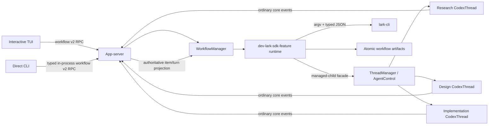

# `dev-lark-sdk-feature` Workflow Design

**Date:** 2026-07-16  
**Status:** Design sections approved; written-spec review pending  
**Repository:** `codex/`  
**Target repository:** `/Users/bytedance/project/lark-client-ai-know-bugfix/rust-sdk`

## 1. Summary

Add a production Codex workflow named `dev-lark-sdk-feature`. Users start it from either the
interactive TUI:

```text
/workflow dev-lark-sdk-feature --developers <comma-separated-open-ids> [--artifacts-dir <relative-path>]
```

or the direct CLI:

```bash
codex workflow dev-lark-sdk-feature \
  --developers <comma-separated-open-ids> \
  [--artifacts-dir <relative-path>]
```

The workflow validates the Lark Rust SDK repository, obtains one explicit confirmation before any
Lark write, creates a Lark group, and then runs three real Codex child threads:

1. requirement understanding and code research;
2. technical-design authoring and revision;
3. test-driven implementation.

The first eligible, developer-authored, bot-mentioned Lark message is the requirement. Research
continues sequentially in the same child thread until an eligible `/finish` command. The design
child then produces a technical design and accepts revision feedback until an eligible
`/approve-design` command records approval of the exact design digest. Only then may the
implementation child start.

The workflow does not implement a separate agent loop. Child work enters the ordinary core path:
`Op::UserInput` -> submission loop -> `RegularTask` -> `run_turn` -> model/tool sampling loop ->
rollout events and persistence. The app-server remains the sole consumer of each `CodexThread`
event receiver and projects authoritative completed assistant items to the workflow runtime.

## 2. Goals

- Provide one shared typed invocation model for TUI and CLI.
- Validate the repository and artifact path before creating artifacts, threads, or Lark side
  effects.
- Require one scope confirmation before the first Lark write and a separate in-chat approval of the
  generated technical design before implementation.
- Use bot identity for all Lark operations and typed JSON at an injectable process boundary.
- Keep every workflow stage inside real parent/child Codex thread, turn, event, persistence, and
  cancellation machinery.
- Preserve the parent/child graph and existing TUI child navigation.
- Persist crash-safe workflow state without persisting credentials.
- Make explicit retriggering safe after interruption without exposing a public resume flag.
- Provide focused, deterministic tests that perform no real Lark writes.

## 3. Non-goals

- A general-purpose workflow framework or workflow-definition language.
- Adding Lark orchestration to `codex-core`.
- Exposing the crate-private `Session` or task helpers as general public APIs.
- Replacing ordinary model, tool, approval, sandbox, rollout, or thread behavior.
- Automatically resuming workflows at Codex startup.
- Automatically deleting a Lark group after completion, failure, or cancellation.
- Supporting this workflow through the official TUI's explicit remote-workspace target.
- Treating one visible Codex turn as one model request.
- Making automated tests depend on real Lark, credentials, or the private design-template document.

## 4. Verified Current Architecture

The following statements describe the current implementation and constrain the design.

### 4.1 TUI and app-server boundary

- No-subcommand CLI dispatch starts the TUI. The TUI selects `Embedded`, `LocalDaemon`, or
  `Remote` internally in `codex-rs/tui/src/lib.rs:260-279` and `:799-846`.
- Embedded uses the typed in-process app-server client. Local daemon and explicit remote use the
  remote app-server client, but local daemon retains local-workspace semantics.
- Both JSON and typed in-process requests enter the same `MessageProcessor` dispatch in
  `codex-rs/app-server/src/message_processor.rs:516-860`.
- The in-process client detaches request futures while continuing to drain notifications in
  `codex-rs/app-server-client/src/lib.rs:453-482`. Dropping a client request therefore does not
  cancel server work.

### 4.2 Thread and child lifecycle

- `ThreadManager` owns the live-thread registry and public thread lifecycle API in
  `codex-rs/core/src/thread_manager.rs:182`.
- `CodexThread` is the public handle around the active `Codex` runtime and exposes submission and
  event APIs in `codex-rs/core/src/codex_thread.rs:162-421`.
- Public `ThreadManager::spawn_subagent` at `thread_manager.rs:725` is a fork-oriented convenience
  path. The managed parent/child path that reuses the parent's `AgentControl`, agent graph,
  capacity accounting, lineage metadata, and notifications is currently crate-private:
  `AgentControl::spawn_agent_with_metadata` and `spawn_agent_internal` in
  `codex-rs/core/src/agent/control/spawn.rs:117-415`.
- Child discoverability after reconnect depends on `SessionSource::SubAgent(ThreadSpawn { ... })`;
  the TUI backfills that lineage in `codex-rs/tui/src/app/loaded_threads.rs:1-114`.

### 4.3 Submission, turn, and event lifecycle

- `CodexThread::submit_user_input_with_client_user_message_id` in
  `codex-rs/core/src/codex_thread.rs:262-276` feeds the existing submission path and preserves a
  caller-provided stable user-message identity.
- A session has at most one active task. Active-turn state and task cancellation are maintained in
  `codex-rs/core/src/state/turn.rs:29-83` and `codex-rs/core/src/tasks/mod.rs:325-560`.
- One user-visible turn can perform multiple internal model sampling steps. Tool output is recorded
  and the same turn samples again through the ordinary `run_turn` loop.
- `CodexThread::next_event` delegates to a single receiver in
  `codex-rs/core/src/codex_thread.rs:420-421`; it is not a broadcast stream.
- The app-server thread listener is the existing sole consumer at
  `codex-rs/app-server/src/request_processors/thread_lifecycle.rs:289-325`.
- The authoritative final assistant body arrives in a completed `TurnItem::AgentMessage` and is
  projected as `item/completed` in
  `codex-rs/app-server/src/bespoke_event_handling.rs:980-989,1369-1382`.
- `turn/completed` is terminal metadata and does not contain those completed items; its projection
  is built at `bespoke_event_handling.rs:1228-1244`.

### 4.4 App-server delivery

- Request and notification definitions are generated from macros in
  `codex-rs/app-server-protocol/src/protocol/common.rs:198-365,472-1129,1367-1666`.
- `ThreadScopedOutgoingMessageSender` snapshots its subscriber list at construction in
  `codex-rs/app-server/src/outgoing_message.rs:108-169`.
- The normal thread listener resolves current subscribers for every event at
  `codex-rs/app-server/src/request_processors/thread_lifecycle.rs:322-330`.
- The in-process transport intentionally treats some progress as lossy while protecting terminal
  and transcript-critical notifications in `codex-rs/app-server/src/in_process.rs:105-111` and
  `codex-rs/app-server-client/src/lib.rs:131-151`.

These facts rule out a workflow-owned clone of `next_event`, a parallel sampling loop, unrelated
top-level stage threads, or terminal-event summaries as the assistant-output source.

## 5. Chosen Architecture

### 5.1 Component boundary

Introduce a focused workspace crate:

```text
codex-rs/dev-lark-sdk-feature/
```

with Cargo package name `codex-dev-lark-sdk-feature`. It owns workflow-specific parsing,
validation, state transitions, manifest persistence, Lark process execution, prompt rendering,
and orchestration. It is not a generic workflow engine.

The app-server owns the live `WorkflowManager` instance and provides adapters for:

- managed child-thread creation;
- authoritative turn completion tracking;
- root-thread subscriber projection;
- app-server protocol requests and notifications.

`codex-core` receives only a narrow managed-child façade needed to reuse its existing internal
multi-agent lifecycle. The TUI and direct CLI remain clients of app-server requests and never own
workflow runtime state.



### 5.2 Proposed principal types

Names in this subsection are proposed APIs, not current types.

| Type | Owner | Responsibility |
|---|---|---|
| `WorkflowInvocationArgs` | workflow crate | Shared Clap parser used by TUI and CLI. |
| `DevLarkSdkFeatureArgs` | workflow crate | Raw typed arguments before repository-bound validation. |
| `DevLarkSdkFeatureConfig` | workflow crate | Canonical repository, normalized developers, safe artifact path. |
| `PreparedWorkflow` | app-server manager | One-use, expiring, read-only preparation and confirmation data. |
| `WorkflowManager` | app-server | Prepared/running registry, locks, cancellation roots, terminal guards. |
| `WorkflowRuntime` | workflow crate | One run's stage machine and durable checkpoints. |
| `WorkflowManifest` | workflow crate | Versioned, non-secret durable run state. |
| `ManifestStore` | workflow crate | Atomic reads/writes and artifact layout. |
| `LarkCommandRunner` | workflow crate | Injectable argv-based, cancellation-aware process boundary. |
| `LarkClient<R>` | workflow crate | Typed group, member, polling, and send operations over a runner. |
| `ManagedChildSpec` | core public façade | Stage prompt, working directory, lineage, and instruction overrides. |
| `ManagedChildStart` | core public façade | Child thread ID, initial turn ID, and agent path. |
| `WorkflowTurnTracker` | app-server | Waiters and bounded terminal cache fed by the sole thread listener. |
| `WorkflowProgressSink` | app-server adapter | Persists then projects root-scoped workflow progress. |

Protocol DTOs remain in `codex-app-server-protocol` and convert explicitly to/from these runtime
types. They do not own locks, `Arc<CodexThread>`, cancellation tokens, command runners, or stores.

## 6. Invocation and Validation

### 6.1 Shared parser

The workflow crate provides one Clap-derived invocation parser and subcommand enum. The direct CLI
embeds the same subcommand type under `codex workflow`. The TUI uses its existing slash parser to
extract the untouched remainder, splits it with a shell-lexing library, and invokes the same Clap
parser. No shell executes the parsed string.

Supported arguments:

```text
dev-lark-sdk-feature
  --developers <comma-separated-open-ids>
  [--artifacts-dir <relative-path>]
```

Validation rules:

- `--developers` is required.
- Each value begins with `ou_` and has a bounded, non-empty ASCII-alphanumeric suffix.
- Empty entries, duplicate IDs, malformed IDs, and more than 50 developers are rejected.
- Input order is retained for presentation; normalized equality is used for duplicate detection.
- `--artifacts-dir` defaults to `dev-lark-sdk-feature`.
- Raw values are never interpolated into a shell command.

The app-server repeats semantic validation after DTO conversion. Client-side parsing is usability,
not a trust boundary.

### 6.2 Repository identity

Before artifacts, threads, or any Lark write, the server:

1. canonicalizes the supplied/current working directory;
2. verifies that it is the repository root rather than accepting a basename match;
3. parses the root Cargo workspace and verifies stable members/packages including
   `lark-integrator`, `lark-api-chat`, and `lark-biz-chat`;
4. verifies the repository's root `AGENTS.md` and `.ai_knowledge/architecture.md` markers;
5. returns a typed `WrongRepository` error when any required marker is absent or inconsistent.

The validator does not reject a dirty SDK worktree. The implementation child records the initial
worktree state and must preserve unrelated changes.

### 6.3 Artifact path safety

The path validator rejects:

- absolute paths;
- empty normalized paths;
- `..` components that escape the repository;
- an existing symlink whose canonical target escapes the repository;
- a missing descendant beneath an existing symlink that escapes the repository.

Before confirmation, it canonicalizes the deepest existing ancestor and validates the proposed
suffix without creating it. After confirmation, it creates the directory and revalidates the final
canonical path before a Lark write.

## 7. Preparation and External-Side-Effect Confirmation

`workflow/prepare` is read-only. It validates arguments, repository identity, artifact-path safety,
target support, and `lark-cli auth status --json`. It does not create a root thread for direct CLI,
create artifacts, acquire durable run locks, create a group, or send a message.

The response contains a short-lived, one-use opaque `preparationId` bound to:

- the normalized invocation;
- canonical repository path;
- optional existing parent thread ID;
- current app-server instance;
- bot application identity from read-only auth status;
- expiry time.

The exact confirmation contains:

- group name `lark-sdk需求开发`;
- the normalized developer open IDs;
- bot application identity/profile;
- canonical repository and artifact directory;
- an explicit statement that agent outputs will be forwarded to the group.

TUI uses a `SelectionViewParams` confirmation with cancel first and start second, following the
archive/delete pattern in `codex-rs/tui/src/chatwidget/slash_dispatch.rs:176-232`. CLI prompts on a
TTY. Rejection ends without a root thread, artifacts, group, or message created by this workflow.
Non-interactive CLI input without an existing repository-approved confirmation mechanism fails
closed.

`workflow/start` consumes the token once, repeats repository/path/auth validation, and only then
performs the first durable or external side effect. Confirmation state contains no credentials.

## 8. App-server v2 Protocol

Add a dedicated v2 module and the following methods, following current singular-resource naming:

| Method | Purpose |
|---|---|
| `workflow/prepare` | Read-only validation and confirmation preparation. |
| `workflow/start` | Consume preparation and start or explicitly recover a run. |
| `workflow/read` | Return the durable current snapshot and repair lost progress. |
| `workflow/cancel` | Idempotently request cancellation. |

The request union uses a tagged invocation DTO:

```rust
enum WorkflowInvocation {
    DevLarkSdkFeature(DevLarkSdkFeatureWorkflowArgs),
}
```

Wire fields use camel case, optional request fields use the repository's v2 nullable convention,
and IDs are strings at the API boundary. Proposed response/notification payloads carry distinct
`workflowId`, `runId`, `parentThreadId`, `childThreadId`, `turnId`, and Lark identifiers rather
than overloading one identifier.

Notifications:

```text
workflow/progress
workflow/completed
```

Progress contains the root thread, run, monotonically increasing sequence, stage, status, optional
child and turn IDs, safe detail, and timestamp. Completion contains the outcome, artifact path,
optional failure, final sequence, and timestamp.

The manager persists a transition before emitting it. Progress is best-effort and coalescible;
completion is lossless. `workflow/read` is authoritative after lag or reconnect.

The implementation follows `externalAgentConfig/import` for generated operation ID, progress, and
history (`codex-rs/app-server/src/request_processors/external_agent_config_processor.rs:211-352`)
and `process/spawn` for immediate response, cancellation registry, and exactly-once terminal
handling (`codex-rs/app-server/src/request_processors/process_exec_processor.rs:265-398,584-651`).

Workflow notifications are root-thread scoped. The sender resolves the root's current subscribers
for every emission instead of retaining a stale `ThreadScopedOutgoingMessageSender` snapshot.

## 9. TUI and Direct CLI Behavior

### 9.1 TUI

Add `SlashCommand::Workflow`, mark it as accepting inline arguments, and route it through a focused
workflow module rather than expanding the central chat widget. Relevant current paths are:

- command registry: `codex-rs/tui/src/slash_command.rs:12-170`;
- inline arguments: `codex-rs/tui/src/bottom_pane/chat_composer/slash_input.rs:68-127`;
- `CommandWithArgs`: `codex-rs/tui/src/bottom_pane/chat_composer.rs:292-326`;
- dispatch: `codex-rs/tui/src/chatwidget/slash_dispatch.rs:537-1006`.

The TUI asynchronously issues prepare/start/read/cancel through an app-server request handle and
returns typed `AppEvent`s. It does not await server calls in the main render/event loop.

The command is unavailable while the current parent has an active model turn. During a workflow,
the root remains loaded as the parent, retains child navigation, and displays a cancellable
workflow status rather than becoming a workflow `SessionTask`. Workflow-owned stage children
remain visible through existing `ThreadSpawn` lineage and Alt+Left/Right navigation.

Presentation uses:

- the existing transient status indicator for current stage and cancellation;
- a durable workflow history cell for stage transitions, child identity, waiting states, failures,
  and completion;
- existing agent-status and child-thread presentation for stage children;
- authoritative assistant output and artifact paths in Markdown history cells.

When an ordinary parent turn is active, Ctrl+C retains its current turn-interrupt priority. When
the parent is idle and a workflow is active, Ctrl+C sends `workflow/cancel`, shows `Cancelling`,
and drains until terminal notification or `workflow/read` repair.

Supported targets:

- `Embedded`: supported through typed in-process app-server.
- `LocalDaemon`: supported through the same v2 RPCs with local-workspace semantics.
- official TUI explicit `Remote`: rejected by prepare with a typed unsupported-target error.

### 9.2 Direct CLI

Add a private focused `workflow_cmd.rs` beneath the CLI dispatcher. It starts an in-process
app-server, calls prepare before creating a root thread, prompts, then performs `thread/start` and
`workflow/start`. All workflow children attach to that new root.

The CLI event loop selects between app-server events and Ctrl+C. It handles ordinary app-server
approval/server requests through an injectable terminal interaction handler and responds through
the normal app-server response path; unsupported requests fail explicitly rather than hanging.

Human progress goes to stderr and the final result goes to stdout, following `codex exec` and
doctor conventions. If a machine-readable mode is added with this first feature, it emits stable
JSONL only on stdout. Ctrl+C sends one cancel request and drains to a terminal outcome; cancellation
returns a non-success exit.

## 10. Workflow State, Locking, and Artifacts

### 10.1 Identity and locks

Each run gets a UUIDv7 `runId`. Distinct identities remain distinct:

- app-server request ID;
- preparation/workflow ID;
- run ID;
- root and child thread IDs;
- visible turn/submission ID;
- model response ID;
- Lark chat and message IDs;
- tool call IDs.

Two advisory file locks prevent conflicting active runs:

```text
$CODEX_HOME/workflow-locks/dev-lark-sdk-feature/<parent-thread-id>.lock
<artifact-directory>/.workflow.lock
```

Use the standard library's supported nonblocking file-lock API. A live lock produces a typed
duplicate-run error. Lock files are not themselves proof that a process is live; lock acquisition
is authoritative.

### 10.2 Artifact layout

```text
<sdk-root>/<artifacts-dir>/
├── current.json
├── .workflow.lock
└── runs/<run-id>/
    ├── manifest.json
    ├── chat_id.txt
    ├── prompts/
    ├── assistant-outputs/
    ├── research/
    │   ├── requirement-understanding.md
    │   ├── historical-implementation.md
    │   ├── code-test-map.md
    │   └── questions-decisions.md
    ├── design/
    │   ├── technical-design.md
    │   └── approval.json
    ├── implementation/
    │   ├── summary.md
    │   ├── tests-executed.md
    │   └── remaining-risks.md
    └── verification-report.md
```

`current.json` points to the run selected for explicit retrigger recovery. `chat_id.txt` is the
simple human-readable chat artifact. Rendered prompt copies support auditability.

### 10.3 Manifest

The versioned manifest includes at least:

- schema version, workflow name, workflow/run IDs;
- canonical SDK repository and artifact paths;
- root thread ID and child thread IDs by stage;
- Lark chat ID and verified bot ID/name;
- current stage, status, transition sequence, and timestamps;
- current/last turn IDs by stage;
- last processed Lark cursor and processed message IDs;
- per-message processing checkpoints;
- outbound stable references/idempotency state;
- design approval message, approver, timestamp, and SHA-256 digest;
- failure record and cancellation state.

It never stores credentials, access tokens, authorization URLs, or raw secret-bearing process
output.

Writes use same-directory temporary files, file `sync_all`, atomic rename, and parent-directory
sync. State is persisted before a progress notification. Intent/commit checkpoints surround
irreversible operations such as group creation and outbound messages.

### 10.4 Stage machine

```text
Initializing
  -> CreatingChat
  -> WaitingForRequirement
  -> Researching
  -> DiscussingRequirements
  -> Designing
  -> WaitingForDesignApproval
  -> Implementing
  -> Completed
```

Any nonterminal stage can enter `Cancelling`, `Cancelled`, or `Failed`. A failed stage is never
silently advanced to completed.

## 11. Lark Process Boundary

### 11.1 Runner

Define a small injectable `LarkCommandRunner` trait whose method returns a `Send` future without
using `async_trait`. Production uses `tokio::process::Command` with:

- an executable plus argv array, never `sh -c`;
- bot identity on every group, member, read, and send operation;
- JSON output;
- bounded stdout/stderr capture;
- per-operation timeout;
- `kill_on_drop` plus explicit cancellation selection;
- sanitized structured diagnostics.

Tests use a fake runner that records argv and returns typed fixtures. Standard tests never invoke a
real `lark-cli` write.

Read-only prepare runs the documented equivalent of:

```bash
lark-cli auth status --json
```

Production group creation uses the shortcut for a normal bot-owned group:

```bash
lark-cli im +chat-create \
  --as bot \
  --chat-mode group \
  --name 'lark-sdk需求开发' \
  --description '<stable workflow run marker>' \
  --format json
```

It then persists `chat_id`, adds configured developers through the schema-inspected bot member API,
and reads members back with pagination. The separate membership step is required to expose partial
membership details that a single convenience operation can obscure. All requested developers must
be verified before the workflow proceeds.

The workflow reads the bot member list and records exactly one creator bot's open ID and name.
Missing bot visibility, missing scopes, app-visibility errors, partial membership, permission
console URLs, and update notices are surfaced as typed safe errors. It does not silently switch to
user identity.

### 11.2 Polling and eligibility

Polling uses the documented equivalent of:

```bash
lark-cli im +chat-messages-list \
  --as bot \
  --chat-id <chat-id> \
  --order asc \
  --page-size 50 \
  --no-reactions \
  --format json
```

The client consumes every page, normalizes oldest-first ordering, and combines an inclusive time
cursor with persisted message IDs. It uses bounded exponential backoff with cancellation and no
busy-waiting.

A message is eligible only when it is:

- not deleted;
- authored by a configured developer;
- not authored by the workflow bot;
- not already durably processed;
- textual content with a structured mention whose ID equals the verified bot ID.

Display-name substring matching is never sufficient.

Commands are detected only after removing the structured bot mention and normalizing remaining
text. `/finish` is valid only after research artifacts exist. `/approve-design` is valid only in
the design-approval gate and for the current design digest. Neither command is submitted as an
ordinary research/design turn.

### 11.3 Message transaction

Each eligible ordinary message advances through durable checkpoints:

```text
Received
  -> TurnSubmitted
  -> AssistantPersisted
  -> ForwardPending
  -> Forwarded
  -> CursorCommitted
```

The stable client user-message ID is derived from the Lark message ID, for example
`lark:<message-id>`. Messages are submitted sequentially to the same stage child, and the next
message is not processed until the visible turn reaches a terminal state.

The assistant output is persisted verbatim before forwarding. Lark output is split into
code-fence-aware chunks with a conservative 8 KiB maximum. Each part has a stable workflow
reference and idempotency key derived from run, stage, turn, and part number. Because native send
idempotency is time-limited, an ambiguous send is reconciled by scanning bot messages for that
stable reference before retrying.

The cursor is committed only after the authoritative assistant item is durable and every required
outbound part is durably known to be sent. This avoids silent message loss; persisted IDs and
references avoid duplicate agent turns or group output.

## 12. Managed Codex Child Threads

### 12.1 Narrow core façade

Add these narrowly scoped public APIs around the existing internal managed-agent path:

```rust
pub struct ManagedChildSpec {
    pub parent_thread_id: ThreadId,
    pub cwd: PathBuf,
    pub initial_input: Vec<UserInput>,
    pub additional_developer_instructions: Option<String>,
    pub metadata: ManagedChildMetadata,
}

pub struct ManagedChildStart {
    pub child_thread_id: ThreadId,
    pub initial_turn_id: String,
    pub agent_path: AgentPath,
}

impl ThreadManager {
    pub async fn spawn_managed_child(...);
    pub async fn shutdown_agent_subtree(...);
}

impl CodexThread {
    pub async fn interrupt_turn_if_active(...);
}
```

Exact Rust field types are finalized during planning against existing ID wrappers, but the public
surface remains at this responsibility level. The façade delegates to the parent's existing
`AgentControl`; it must not duplicate spawn logic.

The spawn operation:

- preserves `ThreadSpawn` parent metadata and agent path;
- participates in depth/capacity accounting and graph status;
- applies the stage working directory;
- clones the parent configuration;
- appends bounded stage-specific developer instructions without replacing base instructions;
- submits the initial input through the ordinary core path;
- returns the child and initial visible-turn identities;
- reports a child ID in a partial-spawn error when cleanup/recovery needs it.

Subsequent messages use
`CodexThread::submit_user_input_with_client_user_message_id`, not generic raw operation strings or
private `Session` methods.

The appended developer instructions are necessary because later Lark messages are untrusted user
input. Current `Config` already carries `developer_instructions` at
`codex-rs/core/src/config/mod.rs:683`, and session context incorporates them in
`codex-rs/core/src/session/mod.rs:3255`.

### 12.2 Turn tracking without receiver competition

The app-server remains the sole `next_event` consumer. Its existing item/turn projection updates a
`WorkflowTurnTracker` keyed by `(child_thread_id, turn_id)`. The tracker holds:

- waiters registered by the workflow manager;
- completed assistant items for the visible turn;
- terminal status;
- a bounded terminal cache for races where completion precedes waiter registration.

On `item/completed`, it records `ThreadItem::AgentMessage`. On `turn/completed`, it closes the turn
and chooses the authoritative output:

1. the last completed agent message whose phase is `Final`, when phases are present;
2. otherwise the last completed legacy agent message;
3. no terminal summary fallback.

Missing output is a typed failure, not an empty successful response. Workflow tracker updates do
not steal or suppress the normal notification sent to clients.

Workflow-owned children reject unrelated external `turn/start` while the stage is active. This
protects sequential Lark ordering and the one-active-task invariant. Once a stage finishes, its
subtree is flushed and shut down; its rollout and thread metadata remain available for history and
recovery.

## 13. Stage Prompts and Artifacts

Prompt sources live in:

```text
codex-rs/dev-lark-sdk-feature/prompts/
├── research-developer.md
├── research-turn.md
├── technical-design-developer.md
├── technical-design-turn.md
├── implementation-developer.md
└── implementation-turn.md
```

They are embedded with `include_str!`; Cargo and Bazel declarations include them as compile data.
Rendered copies are written beneath the run's `prompts/` directory.

Every prompt separates:

- role and stage objective;
- trusted workflow context;
- developer-priority safety and scope rules;
- required artifacts and output contract;
- runtime user/Lark content.

Runtime content is canonical JSON inside a generated collision-free boundary. Developer
instructions explicitly classify it as untrusted user data. Prompts prohibit secrets in artifacts
and assistant output.

### 13.1 Research child

The first eligible, bot-mentioned developer message creates the research child and is its initial
user turn. There is no synthetic research turn before that requirement.

The prompt requires the child to:

- read every applicable SDK `AGENTS.md`;
- report missing referenced instructions rather than inventing them;
- clarify the requirement and identify ambiguity/risk;
- inspect current and historical SDK code and focused tests;
- cite concrete SDK files and tests;
- write all four research artifacts;
- avoid modifying SDK application source.

Later eligible messages are sequential user turns on the same child. After `/finish`, the runtime
verifies the four artifacts before advancing.

### 13.2 Technical-design child

The design child reads the research artifacts, applicable SDK instructions, current SDK code, and
the private template:

```text
https://bytedance.larkoffice.com/wiki/WJ75waky6iQZNskxEO2c7RAAnfd
```

Its developer instructions require a supported Lark document skill or `lark-cli` path rather than
assuming public web access. It follows relevant template structure, distinguishes evidence from
assumption, compares alternatives, and covers trade-offs, risks, rollout, and testing. It writes
`design/technical-design.md` and does not implement code.

The authoritative result and artifact path are forwarded to Lark and parent presentation. While
waiting for approval, ordinary eligible messages become sequential design-revision turns on this
same child. Every revision invalidates an earlier candidate digest.

An eligible `/approve-design` records `design/approval.json` with approver open ID, source message
ID, timestamp, and SHA-256 of the exact technical-design artifact. The implementation stage
recomputes and verifies this digest before editing.

### 13.3 Implementation child

The implementation child starts only after design approval. Its prompt requires it to:

- read all research, design, and approval artifacts;
- read all applicable SDK instructions;
- inspect and record the SDK dirty worktree before editing;
- preserve unrelated changes;
- implement the approved design using test-driven development;
- use ordinary Codex model, tool, approval, and sandbox behavior;
- run focused SDK formatting, linting, and tests;
- write implementation summary, executed-tests, and remaining-risk artifacts.

The workflow completes only after the visible implementation turn is terminal, its authoritative
assistant item and artifacts are persisted, required output is forwarded, child/thread persistence
is flushed, and the final manifest is durable.

## 14. Parent Progress and Presentation

The workflow publishes root-thread-scoped progress for:

- start and selected run identity;
- group creation and verified membership;
- waiting for the first requirement;
- each child creation and identity;
- visible turn start and completion;
- waiting for additional Lark input;
- waiting for technical-design approval;
- failure, cancellation, and completion.

These notifications are presentation metadata. They are not inserted into the parent model's
conversation or rollout. Actual child conversations remain in their child rollouts. The root
thread remains the lineage owner and UI observation scope.

The TUI repairs lossy progress with `workflow/read` after `Lagged` or reconnect. Direct CLI uses
the same snapshot to initialize or repair its renderer. Completion delivery is protected in both
the app-server in-process path and app-server-client event pump.

## 15. Cancellation and Shutdown

`WorkflowManager` owns one root `CancellationToken` per run and derives tokens for polling, Lark
processes, and stage work. The child session continues to own its active task and turn token; the
workflow does not replace core task ownership.

Cancellation order:

1. persist `Cancelling`;
2. cancel polling and the active `lark-cli` process;
3. call the managed-child interruption façade for an active turn;
4. shut down remaining workflow-owned child subtrees;
5. flush child/thread and workflow persistence;
6. persist `Cancelled`;
7. emit exactly one terminal workflow notification.

Parent `wait_until_terminated` is watched by the manager. Graceful parent shutdown, archive,
delete, or embedded app-server shutdown cancels the workflow. An unexpected local-daemon client
disconnect does not cancel server-owned work; a reconnect repairs through `workflow/read`.

A Lark group is never automatically deleted.

## 16. Failure Model

Persist a safe structured record:

```rust
pub struct WorkflowFailureRecord {
    pub code: WorkflowFailureCode,
    pub stage: WorkflowStage,
    pub operation: String,
    pub retryable: bool,
    pub safe_message: String,
    pub occurred_at: i64,
}
```

Failure families:

- invocation and repository validation;
- confirmation rejection or expiry;
- artifact initialization and locking;
- Lark executable, authentication, scopes, visibility, JSON, timeout, update, or membership;
- duplicate/out-of-order/ineligible messages and outbound ambiguity;
- child creation, turn abort/failure, model/tool failure, or missing assistant output;
- missing/invalid artifacts, premature `/finish`, approval/digest mismatch;
- polling/process/turn/parent cancellation;
- rollout, manifest, finalization, or shutdown persistence.

Unsafe raw diagnostics remain in bounded in-memory tracing only after sanitization. User-visible and
persisted failures include actionable safe context such as missing scopes or a non-secret console
location. A stage is complete only after all required persistence and forwarding checkpoints.

## 17. Explicit Retrigger Recovery

There is no public resume flag and no automatic startup recovery. The only entry is another
explicit `/workflow ...` or `codex workflow ...` invocation.

After fresh validation and confirmation, `workflow/start` acquires both locks and inspects
`current.json`:

- a live locked run is rejected;
- an unlocked failed/interrupted run for the same canonical repository, artifact directory, and
  parent is recovered;
- a completed run causes a new UUIDv7 run;
- conflicting invocation identity is rejected rather than merged.

Direct CLI recovery reuses the root thread recorded in the manifest. TUI recovery must be invoked
from that owning parent thread.

Recovery behavior by checkpoint:

- group intent without `chat_id`: search by name, then require an exact unique run-description
  marker before deciding whether to create;
- known `chat_id`: verify group, bot, and membership instead of recreating;
- `TurnSubmitted`: inspect live child state and durable thread history; reconstruct only an
  unambiguous terminal result;
- `AssistantPersisted`: do not resubmit the turn;
- `ForwardPending`: reconcile stable outbound references before retrying;
- `WaitingForDesignApproval`: resume polling without rerunning design;
- terminal implementation child with incomplete finalization: verify artifacts, forward if needed,
  flush, and finalize.

Ambiguous state fails explicitly and preserves artifacts for diagnosis. Recovery never silently
creates duplicate groups, duplicate child turns, or duplicate outbound content.

## 18. Security and Trust Boundaries

- Lark content is untrusted user input even when the sender is authorized.
- Structured sender and mention IDs establish eligibility; display text does not.
- Stage developer instructions outrank runtime Lark content and constrain allowed stage actions.
- Raw invocation strings never reach a shell.
- Paths are canonicalized and repository-bound before use.
- Credentials and tokens are neither logged nor persisted.
- Prompt and assistant artifacts are bounded; outbound chunking is bounded.
- External confirmation explicitly warns that agent output is forwarded to the group.
- The workflow does not grant child agents permissions beyond ordinary Codex configuration,
  approval, and sandbox policy.

## 19. Test Strategy

All implementation follows red-green-refactor with focused tests.

### 19.1 Parser, validation, and preparation

- TUI `/workflow` parsing, quoting, missing command, and malformed arguments.
- Direct CLI parse and exact parity with the shared parser.
- required/empty/malformed/duplicate/over-limit developer IDs.
- repository marker success and typed wrong-repository failure with no side effects.
- default artifact path, normalization, absolute/traversal/symlink escape rejection.
- preparation token binding, expiry, one-use behavior, rejection, and revalidation.
- TUI/CLI confirmation content and no-side-effect cancellation.

### 19.2 Manifest, locks, and recovery

- idempotent initialization and complete artifact layout.
- atomic update behavior and failure injection before/after rename.
- parent/artifact lock contention and stale-file acquisition.
- failpoints after group intent, chat persistence, turn submission, assistant persistence, send,
  cursor commit, and terminal child completion.
- explicit retrigger behavior, completed-new-run behavior, and conflict rejection.
- no credentials in serialized state.

### 19.3 Lark adapter

- exact argv and bot identity for auth, group, member, bot, poll, and send operations.
- typed JSON success/error/update parsing and bounded diagnostics.
- group creation, partial membership, verification, and visibility failures.
- pagination, oldest-first ordering, inclusive cursor, and message-ID deduplication.
- unauthorized sender, missing mention, wrong mention, deleted message, and bot-self filtering.
- `/finish` and `/approve-design` state-dependent detection.
- stable send identities, chunking, code-fence handling, ambiguous-send reconciliation.
- timeout and cancellation while a fake process is running.

### 19.4 Core and ordinary agent path

- managed child lineage, `ThreadSpawn` metadata, graph capacity, and initial turn ID.
- partial spawn failure, active-turn interruption, subtree shutdown, and rollout retention.
- sequential multiple Lark submissions to one child through
  `submit_user_input_with_client_user_message_id`.
- mocked Responses function call followed by tool output and a second sampling request, proving the
  ordinary model/tool loop is reused.
- `AgentMessage` completion before terminal turn handling and persisted rollout reconstruction.

Use `core_test_support::responses`, retain response mocks, and assert structured outbound request
bodies. The existing function-call sequence helper in
`codex-rs/core/tests/common/responses.rs:1466` is the preferred basis.

### 19.5 App-server protocol and projection

- JSON-RPC `workflow/prepare`, `start`, `read`, and `cancel` through `TestAppServer`.
- schema and TypeScript fixtures, serialization scope, correlated IDs, and immediate start response.
- current-subscriber projection, unsubscribe/reconnect behavior, and `read` repair.
- response-before-completion, cancellation races/idempotency, and exactly one terminal notification.
- typed in-process parity and guaranteed workflow-completion delivery.
- authoritative assistant extraction and no terminal-summary fallback.

### 19.6 TUI and CLI

- slash registry and inline-argument dispatch.
- confirmation and workflow history/status snapshots.
- child status/navigation, waiting states, progress lag repair, failure, and completion.
- Ctrl+C priority for active parent turns and workflow cancellation while parent is idle.
- direct CLI human stdout/stderr contract, machine output if present, approvals, cancellation, and
  terminal exit behavior.

### 19.7 Stage integration

- first eligible Lark message becomes the initial research turn.
- multiple sequential research messages use the same child.
- `/finish` verifies artifacts and starts design.
- design feedback stays on the design child and invalidates the prior digest.
- approval records exact digest; changed design cannot start implementation.
- implementation reaches completion only after artifacts, forwarding, flush, and manifest commit.
- every required failure/cancellation boundary is visible and durable.
- prompt rendering is deterministic, delimiter-safe, and stage-scoped.

Automated tests use fake Lark runners, temporary repositories, offline prompt/template fixtures,
and mocked model responses. They make no real Lark writes and do not require the private template
to be online.

## 20. Verification

Focused verification after implementation:

1. `just fmt` from `codex-rs`.
2. `just fix -p <affected-crate>` for each affected Rust crate; use workspace-wide fix only when
   shared-crate changes require it.
3. `just write-app-server-schema` and experimental schema generation only if the API is gated as
   experimental.
4. `just test -p codex-app-server-protocol`.
5. focused tests for the new workflow crate, core, app-server, TUI, and CLI.
6. review and accept intentional TUI snapshots.
7. update Cargo/Bazel dependency locks and compile-data declarations when dependencies or embedded
   prompts require them.
8. affected Bazel targets, including prompt data/runfile coverage.

Repository guidance requires asking before the complete Codex workspace test suite after shared
core/protocol changes. No success claim is made until verification-before-completion has checked
fresh command output.

After automated verification, a separately identified manual capability check may use the exact
user-authorized command:

```bash
lark-cli im +chat-create --users 'ou_17f75702d3185ddad1f1c6c54679ae38' --as bot
```

That command is not an automated test. The authorization does not imply permission for additional
messages or automatic group deletion. A full live workflow and private-template check remain
manual verification items.

## 21. Change-size Strategy

This feature necessarily crosses core, protocol, app-server, TUI, CLI, and a new focused crate. The
repository's review-size guidance means implementation must be decomposed into coherent,
individually tested milestones rather than one monolithic diff:

1. workflow domain/parser/validation/persistence/Lark fakes and prompt fixtures;
2. narrow core managed-child façade and integration coverage;
3. app-server protocol, manager adapters, tracking, schema, and public API tests;
4. TUI and CLI clients, rendering, cancellation, and snapshots;
5. complete stage orchestration, cross-boundary tests, documentation, and verification.

The detailed implementation plan will identify dependency-safe commits and red-green checkpoints.
This decomposition does not introduce a generic framework or reduce the final required behavior.

## 22. Developer Documentation

Implementation updates only narrowly relevant documentation:

- `codex-rs/app-server/README.md` for the new v2 methods and notifications, as required by
  repository instructions;
- generated app-server schema and TypeScript fixtures;
- the existing Codex development lesson's custom-workflow material under the separate
  `docs/codex-dev-lesson/` workspace when its verified API map becomes outdated.

General product documentation is not added under `codex/docs`, consistent with `AGENTS.md`. This
file is an implementation design artifact under the Superpowers specification exception.

## 23. Documentation Drift and Remaining Evidence Gaps

Verified drift or constraints:

- Public `spawn_subagent` is not the managed metadata-aware path required here; the correct path is
  currently private.
- Terminal `turn/completed` does not carry the authoritative assistant body.
- `next_event` is destructive and cannot be cloned as a broadcast subscription.
- Exact active-turn abort is private; a guarded façade is needed.
- In-process progress can be dropped under backpressure.
- The SDK's `AGENTS.md` references `.ai_knowledge/knowledge_guide.md`, which is currently absent.
- Lark guidance recommends user identity for some follow-up membership cases, but this workflow is
  required to remain bot-only; it therefore fails explicitly on bot visibility/partial membership.
- The inspected `lark-cli` installation is older than the reported available release; production
  surfaces the notice without updating automatically.

Remaining gaps recorded rather than guessed:

- Real bot sender/mention JSON remains documentation-backed until manual Lark validation.
- Group reconciliation search and description behavior need fake-contract tests and later manual
  confirmation.
- The private design template may be unavailable or unauthorized at runtime; design fails clearly.
- No durable native Lark send-idempotency guarantee covers arbitrary recovery intervals; stable
  visible references and reconciliation remain required.
- Official TUI remote mode is rejected. Arbitrary remote protocol clients are not claimed to be
  supported or securely classified server-side.
- A typed in-process app-server test passed only with an increased Rust stack during investigation;
  the default-stack invocation overflowed before assertions and remains an environment/test-harness
  issue to re-evaluate during implementation.

## 24. Acceptance Criteria

The feature is complete only when:

- both documented invocation forms use the same parser and request model;
- validation and confirmation precede every workflow-created artifact, thread, or Lark write;
- the group is a normal bot-created group with every configured developer verified;
- the first eligible message is the research requirement;
- every stage uses a real managed child thread and ordinary core turn/model/tool persistence;
- eligible Lark messages are processed sequentially and exactly-once at the workflow level;
- the design is explicitly approved by digest before implementation;
- authoritative assistant items are forwarded to Lark and parent presentation;
- cancellation reaches polling, processes, child turns, and durable terminal state;
- explicit retriggering does not duplicate groups, turns, or messages;
- failures remain visible and durable and never become false success;
- schema, focused tests, snapshots, formatting, linting, and affected Bazel checks pass;
- standard automated tests perform no real Lark writes;
- verification-before-completion reports remaining manual checks and risks.

## 25. Evidence Index

Primary current-code evidence used for this design:

- CLI/TUI target selection: `codex-rs/tui/src/lib.rs:260-297,445-478,799-920`.
- Slash parsing and dispatch: `codex-rs/tui/src/bottom_pane/prompt_args.rs:1-25`,
  `tui/src/bottom_pane/chat_composer/slash_input.rs:68-127`,
  `tui/src/chatwidget/slash_dispatch.rs:537-1006`.
- Confirmation UI: `codex-rs/tui/src/bottom_pane/list_selection_view.rs:106-238` and
  `tui/src/chatwidget/slash_dispatch.rs:176-232`.
- Core thread handles: `codex-rs/core/src/thread_manager.rs:182,725`,
  `core/src/codex_thread.rs:162-421`, `core/src/session/mod.rs:746-819`.
- Managed agent spawn: `codex-rs/core/src/agent/control/spawn.rs:106-415`.
- Active-turn ownership/cancellation: `codex-rs/core/src/state/turn.rs:29-83`,
  `core/src/tasks/mod.rs:325-560,834-908`.
- App-server sole listener and subscriber resolution:
  `codex-rs/app-server/src/request_processors/thread_lifecycle.rs:289-330`.
- Authoritative item/terminal projection:
  `codex-rs/app-server/src/bespoke_event_handling.rs:980-989,1228-1244,1369-1382`.
- Protocol registration: `codex-rs/app-server-protocol/src/protocol/common.rs:198-365,472-1129,1367-1666`.
- In-process delivery: `codex-rs/app-server/src/in_process.rs:105-111,384-471,670-691` and
  `codex-rs/app-server-client/src/lib.rs:115-151,453-482`.
- Long-running app-server precedents:
  `codex-rs/app-server/src/request_processors/external_agent_config_processor.rs:211-352` and
  `request_processors/process_exec_processor.rs:265-440,584-651`.
- Child TUI visibility/navigation: `codex-rs/tui/src/app/loaded_threads.rs:1-114`,
  `tui/src/app/agent_navigation.rs:30-255`, `tui/src/app/session_lifecycle.rs:10-138`.
- Core model/tool response fixtures: `codex-rs/core/tests/common/responses.rs:1466`.

Relevant existing tests inspected or executed during design investigation include:

- `codex-rs/core/src/agent/control_tests.rs` managed-spawn and cleanup cases;
- `codex-rs/core/tests/suite/abort_tasks.rs` active-turn abort cases;
- `codex-rs/app-server/src/request_processors/thread_processor_tests.rs` subscription cases;
- `codex-rs/app-server/tests/suite/v2/external_agent_config.rs` asynchronous import cases;
- `codex-rs/app-server/tests/suite/v2/process_exec.rs` response-before-exit and kill cases;
- `codex-rs/app-server/tests/suite/v2/thread_unsubscribe.rs` subscriber behavior;
- `codex-rs/app-server-client/src/lib.rs` delivery/backpressure tests;
- `codex-rs/tui/src/chatwidget/tests/slash_commands.rs` slash and confirmation snapshots;
- `codex-rs/tui/src/app/agent_status_feed_tests.rs` child activity projection;
- `codex-rs/tui/src/app/tests.rs` child navigation and interruption behavior.

Focused app-server precedent tests executed during investigation passed for keyed serialization
scope, process spawn response-before-exit, external-agent import response-before-completion, and
typed in-process v2 dispatch with the stack-size limitation recorded above.

## 26. Approval Record

The user approved the following design decisions during incremental review:

- focused workflow crate owned by app-server rather than a core task or external loop;
- read-only preparation, shared typed parsing, repository/path validation, and one confirmation;
- versioned atomic manifest, dual locking, and explicit-retrigger recovery without a resume flag;
- narrow managed-child façade and app-server-owned authoritative turn tracking;
- bot-only Lark process boundary, two-step membership verification, structured mention filtering,
  sequential turns, and durable outbound reconciliation;
- v2 prepare/start/read/cancel protocol, root-scoped progress/completion, TUI/CLI parity, and explicit
  remote-TUI rejection;
- stage prompt separation, first eligible message as requirement, design digest approval, and
  implementation only after approval;
- the failure, cancellation, recovery, testing, verification, and evidence-gap policy in this spec.
