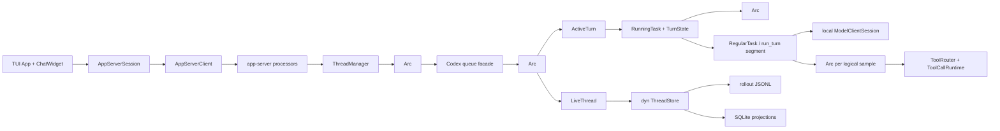

# Codex CLI conversation type map

This page is an implementation-oriented catalog of the types that carry one interactive CLI conversation. It follows the current executable path: the TUI always speaks the app-server protocol, even when the app server is embedded in the same process; app-server then drives `codex-core`.

Companions: [end-to-end flow](codex-cli-conversation-flow.md) and [symbol/call-chain code map](codex-cli-conversation-code-map.md).

## Evidence and notation

- **Confirmed** means executable code or a test establishes the statement.
- **Documented intent** means a source comment describes a contract that is not independently enforced by a test cited here.
- **Interpretation** is an architectural explanation derived from the code.
- **Uncertain** records a remaining evidence gap rather than guessing.
- Visibility is stated explicitly. “Public” means Rust `pub`, not necessarily a stable external API. “Crate-private” means `pub(crate)`; “module-private” includes unqualified items and narrower `pub(super)` items.
- Paths and line numbers refer to this working tree. Source citations beginning with `codex-rs/` are relative to the workspace's `codex/` repository root; for example, `codex-rs/core/src/session/turn.rs` resolves to `../../../codex/codex-rs/core/src/session/turn.rs` from this document. The companion [code map](codex-cli-conversation-code-map.md) contains the ordered call chains and test ledger.

## The shortest useful object model



**Confirmed:** the durable identity is a *thread*. `CodexThread` is one loaded-thread handle; `Codex` is its bidirectional queue facade; `Session` is the live state machine. A regular session task represents one user-visible app-server turn and can invoke `run_turn` more than once for late pending input. Each `run_turn` invocation owns a local `ModelClientSession` and can make several logical samples; each outer sample captures a fresh `StepContext`, while transport retries reuse it. See `codex-rs/core/src/codex_thread.rs:162`, `codex-rs/core/src/session/mod.rs:389`, `codex-rs/core/src/session/session.rs:28`, `codex-rs/core/src/tasks/regular.rs:28`, and `codex-rs/core/src/session/step_context.rs:13`.

## Scope and ownership matrix

| Scope | Principal owner | Important state | Lifetime / synchronization |
|---|---|---|---|
| TUI process | `App` | config, transcript cells, active/primary thread IDs, per-thread event channels | One `App::run`; Tokio/UI event loop; `codex-rs/tui/src/app.rs:503` |
| App-server connection | `AppServerSession` + `AppServerClient` | request counter, target mode, client transport | One TUI run; channel-backed worker; `codex-rs/tui/src/app_server_session.rs:175`, `codex-rs/app-server-client/src/lib.rs:448` |
| App-server runtime | `ThreadManager` | loaded `ThreadId -> Arc<CodexThread>` map and shared factories/services | Shared `Arc<ThreadManagerState>` and async `RwLock`; `codex-rs/core/src/thread_manager.rs:182-240` |
| Loaded thread / live session | `CodexThread` -> `Codex` -> `Arc<Session>` | loaded-runtime metadata, submission/event queues, mutable history/config/services | Until shutdown and all handles drop; bounded submissions, unbounded core events, mutexes; `codex-rs/core/src/codex_thread.rs:162-168`, `codex-rs/core/src/session/mod.rs:389-398` |
| User-visible turn | `ActiveTurn` / `RunningTask` + `Arc<TurnContext>` | task handle, cancellation, pending approvals/input, fixed turn settings | At most one running task per `Session`; `codex-rs/core/src/state/turn.rs:30-96` |
| Model-run segment | one `run_turn` invocation + local `ModelClientSession` | WebSocket/incremental/sticky-routing continuity | Usually one per regular task, but the task can re-enter `run_turn`; `codex-rs/core/src/tasks/regular.rs:68-88`, `codex-rs/core/src/session/turn.rs:143-155` |
| Logical sampling step | `Arc<StepContext>`, router/runtime, prompt | exact environment/MCP/tool snapshot | Fresh for each outer sampling iteration; transport retries reuse it; `codex-rs/core/src/session/step_context.rs:13-24`, `codex-rs/core/src/session/turn.rs:248-295` |
| Tool call | future created from a cloned step-scoped `ToolCallRuntime` + `ToolInvocation` | call ID/payload, same step snapshot, child cancellation, shared diff tracker/gate | Until dispatch/teardown; shared `RwLock` gates parallel vs serial tools; `codex-rs/core/src/tools/parallel.rs:42-105` |
| Persistence | `LiveThread` over `Arc<dyn ThreadStore>` | thread ID, history mode, metadata synchronization | Live session; async store calls; `codex-rs/thread-store/src/live_thread.rs:34-41` |

## Identity vocabulary

### `ThreadId` and `SessionId`

- **Definition:** public UUID wrappers in `codex-protocol`: `ThreadId` at `codex-rs/protocol/src/thread_id.rs:16`, `SessionId` at `codex-rs/protocol/src/session_id.rs:15`. Their UUID fields are crate-private.
- **Purpose/boundary:** `ThreadId` names the user-resumable conversation. `SessionId` is persisted runtime/session metadata. Both provide `new`, `from_string`, string conversions, serde, and `Default`; generated IDs are UUIDv7 (`thread_id.rs:20-24`, `session_id.rs:20-24`).
- **Lifecycle:** `Session::new` chooses/reuses the thread identity. A new root session normally derives its session ID from the thread ID, but the two concepts can diverge for non-root agents and persisted/resumed metadata. The protocol provides lossless conversions (`session_id.rs:45-55`); equality in the common root case is not a semantic equivalence.
- **Invariant/failure:** malformed text fails UUID parsing. Do not correlate a model response, app-server request, or tool call by either ID.
- **Comparison:** a thread ID names the resumable conversation. The Rust `Session` is one loaded engine; `SessionId` is persisted runtime/agent grouping metadata and may be equal to or differ from the thread ID. A submission/turn ID is the narrower per-visible-turn identity.

### Submission/turn ID, request ID, response ID, and tool call ID

- A core submission ID is a UUIDv7 string made by module-private `new_submission_id` (`codex-rs/core/src/session/mod.rs:909`). The normal `Codex::submit`, `submit_with_trace`, and client-message-ID helpers place a generated value in `Submission.id`; `submit_with_id` instead preserves a supplied ID. `Event.id` correlates core events to that submission (`codex-rs/protocol/src/protocol.rs:1267-1275`). For an ordinary `turn/start`, app-server returns this value as the turn ID. The same string becomes `TurnContext.sub_id` (`codex-rs/core/src/session/turn_context.rs:106`).
- An app-server JSON-RPC request ID is connection/request correlation only. TUI `AppServerSession` starts its private counter at `1` and increments it (`codex-rs/tui/src/app_server_session.rs:175-184`, `:1184`). Approval server requests have app-server-generated request IDs and are resolved separately.
- A Responses API response ID arrives in `ResponseEvent::Completed`; WebSocket incremental requests can use it as `previous_response_id`. It is transport continuation state, not a Codex turn ID (`codex-rs/codex-api/src/common.rs:74`, `codex-rs/core/src/client.rs:290-294`).
- A tool call ID originates in a model `ResponseItem` and is preserved in `ToolCall.call_id`, output items, and history (`codex-rs/core/src/tools/router.rs:29-33`). Pairing model calls with outputs by this ID is a prompt-history invariant. Approval correlation is related but not universally identical: command approval uses `approval_id.unwrap_or(call_id)` where an explicit approval ID exists (`codex-rs/core/src/session/mod.rs:2156-2203`).

## CLI and application-boundary dossiers

### `MultitoolCli` and `Subcommand`

- **Definition/visibility:** module-private clap parser struct and enum in `codex-rs/cli/src/main.rs:106` and `:124`.
- **Purpose:** distinguish bare interactive launch from exec, app-server, MCP, login, sandbox, and other modes. They own parsed launch arguments, not runtime conversation state.
- **Construction/use:** `main` enters `arg0_dispatch_or_else`; after helper/argv dispatch, clap parses these types. The no-subcommand branch calls `run_interactive_tui` (`codex-rs/cli/src/main.rs:956-993`, `:2236`). The outer helper creates a named OS thread and a Tokio multi-thread runtime (`codex-rs/arg0/src/lib.rs:208-280`).
- **Failure/invariant:** pre-runtime helper dispatch can replace the process before clap/TUI. Invalid CLI/configuration exits before any thread exists.
- **Comparison:** these are launch-time values; `AppCommand` is a running-TUI command and core `Op` is the runtime submission protocol.

### `AppServerTarget`

- **Definition:** crate-private enum `Embedded | LocalDaemon { endpoint } | Remote { endpoint }` in `codex-rs/tui/src/lib.rs:261-266`.
- **Purpose:** choose app-server transport and workspace semantics without changing the TUI’s protocol-facing architecture.
- **Lifecycle/APIs:** selected during `run_main`; `uses_remote_workspace` and private `thread_params_mode` determine whether thread parameters come from local config or the remote workspace (`tui/src/lib.rs:268-279`). Explicit remote wins; an implicit local daemon is reused only for replayable launch overrides; otherwise embedded is selected (`tui/src/lib.rs:799-845`).
- **Boundary/invariant:** `LocalDaemon` uses `ThreadParamsMode::Embedded`; only `Remote` uses remote workspace semantics. “Embedded” does **not** mean the TUI calls core directly.
- **Comparison:** `AppServerTarget` is launch policy; `AppServerClient` is the active transport facade.

### `AppServerClient`, `InProcessAppServerClient`, and `RemoteAppServerClient`

- **Definitions:** public sum enum `AppServerClient` at `codex-rs/app-server-client/src/lib.rs:448`; public in-process client at `:431`; public remote client at `codex-rs/app-server-client/src/remote.rs:151`; public incoming `AppServerEvent` at `app-server-client/src/lib.rs:96`.
- **Purpose/boundary:** provide one request/notification/event API across embedded, Unix-socket daemon, and WebSocket app server. They deliberately expose protocol messages, not `CodexThread` or `Session`.
- **Ownership/lifecycle:** the in-process client owns bounded command/event channels and a worker task (`app-server-client/src/lib.rs:431-435`); `start` starts the embedded runtime and worker (`:452-500`). Remote owns a bounded command channel, unbounded event receiver, pending-event queue, server metadata, and worker (`remote.rs:151-158`); `connect` chooses WebSocket or Unix socket (`:166-187`).
- **Async behavior:** in-process request waits run in detached tasks so the worker can continue draining events. Selected transcript/terminal notifications are lossless; other saturation is surfaced as `AppServerEvent::Lagged`, not silently treated as a valid transcript (`app-server-client/src/lib.rs:96-124`).
- **Failure:** disconnect becomes `Disconnected`; worker/channel failure prevents future requests. In-process requests still traverse a JSON-RPC result envelope (`app-server-client/src/lib.rs:90-94`).
- **Comparison:** in-process removes the OS transport boundary, not the app-server protocol/conversion boundary.

### `AppServerSession`

- **Definition:** crate-private TUI facade in `codex-rs/tui/src/app_server_session.rs:175-185`.
- **Purpose:** convert TUI intent into typed v2 JSON-RPC calls and hide embedded/remote parameter differences.
- **Ownership/lifecycle:** constructed by `AppServerSession::new` (`:228`) from an `AppServerClient`; owned for the TUI run. Fields include monotonically increasing `next_request_id`, remote cwd override, `ThreadParamsMode`, feature fallback flags, and model defaults.
- **Principal APIs:** `start_thread`/source variant (`:462-491`), `resume_thread` (`:492`), `fork_thread` (`:530`), list/read/lifecycle methods (`:616-730`), `turn_start` (`:787`), `turn_steer` (`:863`), and private `next_request_id` (`:1184`).
- **Side effects/output:** sends a typed client request, awaits its JSON-RPC result, validates/deserializes it, and returns TUI-facing state. It does not own the core thread.
- **Failure/invariant:** remote mode omits host-local provider defaults; unsupported `thread/settings/update` is remembered so later calls can use compatibility behavior.
- **Comparison:** `AppServerSession` is the TUI’s RPC convenience layer; app-server `ThreadManager` owns loaded core threads.

### `App`, `ChatWidget`, `AppCommand`, and `AppEvent`

- **Definitions:** crate-private `App` (`codex-rs/tui/src/app.rs:503`), crate-private `ChatWidget` (`tui/src/chatwidget.rs:529`), crate-private `AppCommand` (`tui/src/app_command.rs:26`), and crate-private `AppEvent` (`tui/src/app_event.rs:149`).
- **Purpose/boundary:** `App` owns application navigation/transcript/thread routing; `ChatWidget` owns active conversation presentation/composer state; `AppCommand` is TUI-to-app intent; `AppEvent` is the internal event-loop bus.
- **Important ownership:** `App` owns `chat_widget`, transcript cells, config, app-server target, active/primary thread IDs, per-thread channel maps and listener tasks (`app.rs:503-575`). Widgets send through an unbounded app-event channel; app routing converts `AppCommand::UserTurn` into `turn/steer` or `turn/start`.
- **Lifecycle/APIs:** `App::run` is the select/event loop (`app.rs:759`); input submission builds `AppCommand::UserTurn` (`tui/src/chatwidget/input_submission.rs:65-98`, `:340`); `ChatWidget::handle_server_notification` consumes app-server notifications (`tui/src/chatwidget/protocol.rs:4`). `Tui::draw` renders state (`tui/src/tui.rs:880`).
- **Invariant/comparison:** `AppCommand::UserTurn` is **not** core `Op::UserTurn`—there is no such current core variant. App-server converts it to core `Op::UserInput`.
- **Example (internal):** `composer -> AppEvent::CodexOp(AppCommand::UserTurn{...}) -> App routing -> AppServerSession::turn_start`.

### v2 thread/turn request and notification types

- **Definitions:** public `ThreadStartParams`/`ThreadStartResponse` at `codex-rs/app-server-protocol/src/protocol/v2/thread.rs:56` and `:170`; public `TurnStartParams`/`TurnStartResponse` at `protocol/v2/turn.rs:68` and `:163`; macro-generated public `ServerNotification` at `protocol/common.rs:1388`.
- **Purpose:** stable serializable boundary between UI/client and app-server. Thread start carries sticky configuration and returns a `Thread`; turn start carries `thread_id`, input and optional sticky overrides, and returns a `Turn`.
- **Lifecycle/correlation:** TUI creates request values, app-server processors map them to `StartThreadOptions` or `Op::UserInput`, and bespoke event handling projects core `EventMsg` back to notifications. `TurnStarted`, deltas, `ItemCompleted`, and `TurnCompleted` drive TUI state (`tui/src/chatwidget/protocol.rs:60-79`).
- **Invariant:** the app-server turn ID is the core submission ID on the normal path. `ItemCompleted` is the authoritative completed assistant item; deltas are incremental presentation.
- **Uncertain:** schema stability outside this repository is not inferred from `pub`; generated-client compatibility policy should be checked before protocol changes.

## Thread and session lifecycle dossiers

### `ThreadManager` and `ThreadManagerState`

- **Definition:** public `ThreadManager` at `codex-rs/core/src/thread_manager.rs:182`; crate-private `ThreadManagerState` at `:239`. `ThreadManager` owns `Arc<ThreadManagerState>`.
- **Problem solved:** centralize creation/resume/fork, lookup, shared service factories, and the in-memory registry of loaded threads. It prevents app-server from constructing `Session` directly.
- **Responsibility boundary:** owns the loaded map and shared managers/store; it does not process submissions or own turn state. `CodexThread` does not own the registry.
- **Important fields:** `ThreadManagerState.threads: Arc<RwLock<HashMap<ThreadId, Arc<CodexThread>>>>`, creation broadcast, auth/models/environment/skills/plugins/MCP/code-mode managers, extensions, `Arc<dyn ThreadStore>`, graph/attestation/time providers (`:239-265`). The extra `Arc` supports weak references from `AgentControl` without forcing `Arc<Self>` receivers (comment at `:236-238`).
- **Construction/lifecycle:** public `ThreadManager::new` (`:305`) builds manager-scoped services and state. App-server retains it for its runtime. `get_thread` (`:568`) clones an `Arc`; `remove_thread` (`:894`) removes registry ownership; `shutdown_all_threads_bounded` (`:901`) submits shutdown concurrently with a bound.
- **Start APIs:** public `start_thread` (`:647`) and `start_thread_with_tools` (`:653`) are convenience wrappers; public `start_thread_with_options` (`:679`) is the configurable entry; crate-private `ThreadManagerState::spawn_thread_with_source` (`:1519`) handles new/resume/fork/subagent details.
- **Creation call relation:** `spawn_thread_with_source -> Codex::spawn -> finalize_thread_spawn`. Finalization requires the first event to be `SessionConfigured` with `INITIAL_SUBMIT_ID`, creates `Arc<CodexThread>`, and inserts it atomically; a duplicate is shut down (`:1636-1678`). A resume of an already-running matching thread returns the existing handle (`:1545-1564`).
- **Outputs/side effects:** returns `NewThread { thread_id, Arc<CodexThread>, session_configured }`, opens persistence via session initialization, spawns the submission loop, updates the registry, and can broadcast creation.
- **Invariants/failures:** registry uniqueness by `ThreadId`; first-event contract; resume path must match the loaded rollout path. Initialization errors leave no usable loaded handle; duplicate spawn is shut down.
- **Usage (public boundary):**

  ```rust
  let NewThread { thread_id, thread, .. } =
      manager.start_thread_with_options(options).await?;
  let id = thread.submit(Op::UserInput { /* ... */ }).await?;
  ```

- **Comparison:** `ThreadManager` is a many-thread registry/factory; `CodexThread` is one loaded-thread handle. The former is shared infrastructure; the latter is the per-thread submission/event/persistence access point.
- **Evidence/tests:** app-server v2 thread-start tests call the manager through the real processor (`codex-rs/app-server/tests/suite/v2/thread_start.rs:316`); core creation/resume paths and unit/integration call sites are indexed in the code map.

### `CodexThread`

- **Definition:** public struct in `codex-rs/core/src/codex_thread.rs:162`; constructor is crate-private at `:188`.
- **Problem solved:** give external core consumers a stable, thread-oriented handle while keeping the lower-level queue/session fields private to core.
- **Boundary/fields:** owns a `Codex`, `SessionSource`, startup `SessionConfiguredEvent`, optional rollout path, and mutex-protected out-of-band elicitation registration (`:162-168`). It does not own the manager registry and does not duplicate mutable session history.
- **Construction/lifecycle:** only core finalization constructs it after validating the first event. It is stored as `Arc<CodexThread>` in `ThreadManagerState`; callers clone the `Arc`. It lives until registry removal and all clones drop, normally after `shutdown_and_wait`.
- **Submission APIs:** `submit` (`:202`), `submit_with_trace` (`:254`), and `submit_user_input_with_client_user_message_id` (`:262`). The last performs agent-capacity admission before delegating. `steer_input` (`:284`) bypasses a new queued turn only when the active turn accepts steering.
- **Lookup/lifecycle APIs:** `next_event` (`:420`), hidden materialize/flush methods (`:245`, `:250`), `shutdown_and_wait` (`:211`), rollout/session metadata access (`:498`, `:502`), state DB/config snapshot (`:576`, `:580`). `submit_with_id` exists for controlled correlation (`:416`) but normal callers should use generated IDs downstream in `Codex`.
- **Side effects:** submissions enter a bounded channel; event reads consume the receiver; flush/shutdown affect persistence and background tasks.
- **Invariants/failures:** event receiver is single-consumer through `Codex`; after loop death, queue/event methods return `InternalAgentDied`. Steering checks the expected turn ID.
- **Usage (app-server):** obtain `Arc<CodexThread>` from `ThreadManager`, call `submit_user_input_with_client_user_message_id(Op::UserInput{...}, trace, client_id)`, then keep a listener calling `next_event`.
- **Comparison:** `CodexThread` adds loaded-thread metadata and policy/capacity bridges around `Codex`; `Codex` is the raw queue facade. Neither is the mutable engine—that is `Session`. Durable identity/history is `ThreadId` plus the store, not this handle.

### `Codex`

- **Definition:** struct declared `pub` in the crate-private `session` module at `codex-rs/core/src/session/mod.rs:389`, so it is effectively crate-internal and is not re-exported by `codex-core-api`; crate-private `CodexSpawnArgs` is at `:409`, `CodexSpawnOk` at `:404`, and `Codex::spawn` itself is crate-private (`:476`).
- **Problem solved:** expose the high-level bidirectional agent interface as a submission queue plus event queue while retaining an `Arc<Session>` for internal lifecycle operations.
- **Fields/ownership:** bounded `async_channel::Sender<Submission>`, unbounded `Receiver<Event>`, watch receiver for `AgentStatus`, `Arc<Session>`, and a shared future for submission-loop termination (`:389-400`). The bounded capacity is 512 (`:470`).
- **Construction:** `ThreadManagerState::spawn_thread_with_source` is the production caller. `spawn_internal` creates channels, resolves model/config/instructions/tools, awaits `Session::new`, spawns `submission_loop` on Tokio, and returns the facade/thread ID (`:500-741`).
- **Common APIs:** `submit` (`:746`), `submit_with_trace` (`:750`), user-input/client-ID submission (`:766`), `submit_with_id` (`:786`), `shutdown_and_wait` (`:808`), `next_event` (`:819`), and `steer_input` (`:828`). The first three submission helpers generate a UUIDv7 and send `Submission`; `submit_with_id` accepts an existing `Submission`. None waits for turn completion.
- **Side effects/concurrency:** one background submission loop receives the bounded queue; core producers send to the unbounded event queue. The shared termination future permits multiple shutdown waiters.
- **Failure/invariant:** a closed submission/event channel maps to `CodexErr::InternalAgentDied`; graceful shutdown submits `Op::Shutdown` then waits for loop termination. Startup’s first queued event must be `SessionConfigured` for manager finalization.
- **Usage (crate-internal construction):**

  ```rust
  let CodexSpawnOk { codex, thread_id } = Codex::spawn(args).await?; // crate-private
  let submission_id = codex.submit(Op::UserInput { /* ... */ }).await?;
  let event = codex.next_event().await?;
  ```

- **Comparison:** `Codex` is message-oriented and intentionally small; `Session` owns execution state. `CodexThread` is the public thread-shaped wrapper around it.

### `Session`, `SessionConfiguration`, `SessionState`, and `SessionServices`

- **Definitions:** all crate-private: `Session` and `SessionConfiguration` in `codex-rs/core/src/session/session.rs:28` and `:51`; `SessionState` in `core/src/state/session.rs:26`; `SessionServices` in `core/src/state/service.rs:50`.
- **Problem solved:** separate the live engine into (1) identity/channels/locks, (2) sticky effective configuration, (3) mutable conversation state, and (4) long-lived service handles. This makes turn snapshots explicit and keeps frequently-mutated history behind one mutex.
- **`Session` ownership:** fields include `thread_id`, core event/status senders, `Mutex<SessionState>`, managed-proxy semaphore, invariant features, realtime manager, `Mutex<Option<ActiveTurn>>`, input queue, guardian manager, `SessionServices`, and an internal submission counter (`session.rs:28-48`). It is held by `Arc` in `Codex` and cloned into tasks/tool invocations.
- **Configuration/state/services:** `SessionConfiguration` holds provider/model collaboration settings, instructions, approval/permission profile, environments/workspace roots, source/history/parent metadata and dynamic tools (`session.rs:51-111`). `SessionState` owns that configuration plus `ContextManager`, rate/token flags, additional context, compaction window, prewarm, connector and first-turn state (`state/session.rs:26-48`). `SessionServices` is a long-lived dependency container—not an immutable snapshot—and owns managers, telemetry, session-scoped approval cache, extensions, state DB, optional `LiveThread`, `Arc<dyn ThreadStore>`, session-scoped `ModelClient`, environment/tool caches, and several lock/atomic-swap fields (`state/service.rs:50-108`).
- **Construction/lifecycle:** `Session::new` is crate-private (`session.rs:480`). It chooses/reuses identity, initializes or resumes persistence, joins startup futures, restores history, constructs services/state, commits the `LiveThreadInitGuard`, and emits `SessionConfigured`. It returns `Arc<Session>` and lives through submission-loop shutdown.
- **Turn APIs:** `new_turn_with_sub_id` (`session/turn_context.rs:583`) snapshots sticky state into `TurnContext`; public-within-crate task entry `spawn_task` (`tasks/mod.rs:314`) aborts/replaces old work and calls `start_task` (`:325`). `capture_step_context` (`session/mod.rs:2879`) snapshots per-sample environment/MCP/AGENTS state.
- **Events/persistence/approval:** `send_event` (`session/mod.rs:1768`) correlates with turn ID; `send_event_raw_with_persistence` persists before delivery (`:1965-1985`); `record_conversation_items` mutates history and persists model-visible items (`:2819`); `request_command_approval` installs a oneshot waiter before emitting an approval event (`:2171`); `flush_rollout` (`:1200`) and `persist_rollout_items` (`:3493`) delegate to `LiveThread`.
- **Concurrency/invariants:** the source comment states at most one running task (`session.rs:25-28`). `active_turn` and `state` use separate async mutexes; task cancellation uses `CancellationToken`; pending request responders live in per-turn state. `StepContext` must be used for both advertised and executed tools. Persistence is attempted before corresponding event delivery.
- **Failure:** `LiveThreadInitGuard` discards an opened writer if initialization fails (`thread-store/src/live_thread.rs:43-86`). Persistence append errors are logged in some runtime paths so an agent can continue; explicit flush returns an error and completion emits a warning.
- **Usage (conceptual, internal):** `submission_loop(session) -> new_turn_with_sub_id -> session.spawn_task(..., RegularTask) -> run_turn -> session.capture_step_context`.
- **Comparison:** `Codex` owns queues to a session; `Session` is the engine. A thread is durable identity/history, whereas a `Session` is one loaded runtime incarnation of it. `SessionState` is mutable conversational data; `SessionServices` is the long-lived dependency container with interior mutability.

## Task, turn, and sampling lifecycle dossiers

### `Op`, `Event`, and `EventMsg`

- **Definitions:** public, non-exhaustive `Op` enum at `codex-rs/protocol/src/protocol.rs:528`; public `Event { id, msg }` at `:1267`; public `EventMsg` enum at `:1280`.
- **Purpose/boundary:** `Op` is the command vocabulary entering one core session. `Event` is a submission-correlated delivery envelope; `EventMsg` is the payload vocabulary. They are the core boundary, not the v2 app-server wire boundary.
- **Canonical use:** app-server maps `TurnStartParams` into `Op::UserInput { items, final_output_json_schema, responsesapi_client_metadata, additional_context, thread_settings }` (`protocol.rs:556-575`). A `Codex` submission method wraps it in a `Submission`; normal helpers generate the ID, while `submit_with_id` accepts one. `submission_loop` dispatches it. Core emits `TurnStarted`, item/delta/tool events, and terminal `TurnComplete` or `TurnAborted`; app-server projects them to v2 notifications.
- **Ownership/side effects:** values move through async channels. An `Event.id` copies the active submission/turn ID; startup uses the empty `INITIAL_SUBMIT_ID`.
- **Invariant/failure:** never confuse `Event.id` with a tool call ID or JSON-RPC request ID. `Op::Interrupt` cancels current work; `Op::Shutdown` terminates the session loop.
- **Comparison:** `AppCommand` is TUI intent; `Op` is core intent. `ServerNotification` is the public app-server projection of selected `EventMsg` values.

### `SessionTask`, `RegularTask`, and `SessionTaskContext`

- **Definitions:** crate-private `SessionTaskContext` struct (`codex-rs/core/src/tasks/mod.rs:176`), crate-private `SessionTask` trait (`:214`), and crate-private unit struct `RegularTask` (`core/src/tasks/regular.rs:20`).
- **Problem solved:** allow one `Session` lifecycle mechanism to run regular chat, review, compact, and other workflows while enforcing common cancellation, telemetry, flush, and completion behavior.
- **Boundary:** a `SessionTask` owns one background workflow; on the canonical path, `RegularTask` drives one user-visible regular turn. Other task kinds should not be forced into that equivalence. It does not own durable thread identity or model-provider state. `SessionTaskContext` deliberately exposes only a cloned `Arc<Session>`, turn extension data, auth, and model manager (`tasks/mod.rs:181-206`).
- **Lifecycle:** `Session::spawn_task` (`tasks/mod.rs:314`) aborts existing tasks and `start_task` creates a root cancellation token, `Notify`, `TurnState`, extension context, trace span, and spawned Tokio task (`:325-445`). `RegularTask::run` emits `TurnStarted`, consumes a prewarmed `ModelClientSession`, then calls `run_turn` (`regular.rs:37-90`). Pending same-task input can make it call `run_turn` again before the task completes.
- **Methods:** trait `kind`, `span_name`, async `run`, and optional `abort` (`tasks/mod.rs:214-260`). `RegularTask::new` is crate-private (`regular.rs:23`). Completion flows through `Session::on_task_finished` (`tasks/mod.rs:563`).
- **Side effects/invariants:** start installs `ActiveTurn` before work; spawned work flushes rollout before terminal completion. Cancellation suppresses normal finish and follows abort lifecycle. At most one task is active per session.
- **Usage (internal):** `session.spawn_task(turn_context, input, RegularTask::new()).await`.
- **Comparison:** a task is the runtime driver; the visible regular turn is its protocol/lifecycle interval; one `run_turn` invocation is an internal model-run segment; a logical sampling step is one `StepContext`/prompt/stream within that segment; transport retry is narrower still.

### `ActiveTurn`, `RunningTask`, and `TurnState`

- **Definitions:** crate-private structs at `codex-rs/core/src/state/turn.rs:30`, `:72`, and `:87`.
- **Purpose:** separate the active task handle from mutable waiters/counters that tools and input delivery need during that turn.
- **Ownership:** `Session.active_turn: Mutex<Option<ActiveTurn>>`. `ActiveTurn` owns optional `RunningTask` and `Arc<Mutex<TurnState>>`. `RunningTask` owns task trait object, join handle (`AbortOnDropHandle`), root `CancellationToken`, `Arc<TurnContext>`, extension data, execution guard, and completion notification (`:72-84`).
- **Mutable state:** `TurnState` owns oneshot senders for approvals, permission requests, user input, MCP elicitations and dynamic tools; pending input; mailbox phase; granted permissions; call/token counters (`:87-103`).
- **Lifecycle/APIs:** `start_task` installs state and running handle; approval/request methods insert a sender before emitting; response `Op`s remove/send it. `abort_all_tasks`/`abort_turn_if_active` cancel the token and invoke task cleanup (`tasks/mod.rs:492-555`); `on_task_finished` removes the running task and emits completion.
- **Invariant/failure:** a pending response without a matching sender is stale/invalid; dropping senders resolves waiters as abort/failure. `AbortOnDropHandle` prevents detached task leakage.
- **Comparison:** `ActiveTurn` is the session’s current slot; `TurnContext` is the immutable-ish settings snapshot stored in the running handle; `TurnState` is the mutable request/input bookkeeping.

### `TurnContext`

- **Definition:** public struct with mainly crate-private fields in `codex-rs/core/src/session/turn_context.rs:104`; production constructors/helpers are crate-private.
- **Problem solved:** freeze the effective model, provider, permissions, environment set, instructions, metadata and timing for one user-visible turn so later sticky configuration changes do not make the turn internally inconsistent.
- **Responsibility boundary:** owns/snapshots turn-scoped settings and shared metadata; does not own session history, active-task join handle, exact per-sample MCP list, or model transport connection.
- **Important fields:** `sub_id`, trace/realtime flags, public `Arc<Config>`, `ModelInfo`, `SharedModelProvider`, reasoning/settings, source/history/parent/originator, environment snapshot/cwd/date/timezone, approval/permission/network settings, schema/dynamic tools, extension/skills/timing/terminal-error state (`turn_context.rs:104-153`).
- **Construction/lifecycle:** `Session::new_turn_with_sub_id` (`:583`) derives one from locked `SessionState`; module helper `make_turn_context` (`:477`) assembles it. For `Op::UserInput`, this is initially a candidate: `user_input_or_turn_inner` attempts to steer an existing task first, and only the idle branch installs the candidate through `start_task` (`session/handlers.rs:194-285`). Once stored in `RunningTask`, it lives until all task/tool clones drop.
- **Common methods:** permission/sandbox accessors, effective reasoning/context window, feature checks (`:157-215`), and model-adjusted cloning for special paths. Most are crate-private despite the type being public.
- **Call relation:** submission handler creates it; task/run loop reads it; `capture_step_context` embeds an `Arc` to it; `ModelClientSession::stream` receives its request settings; approval/sandbox decisions read it.
- **Invariants/failure:** `sub_id` is the core submission/app-server turn ID. Turn policy must remain consistent during all sampling/tool continuations. Terminal error and one-shot warning flags are shared across the turn.
- **Usage (internal pseudocode):**

  ```rust
  let turn = session.new_turn_with_sub_id(submission_id, overrides, trace).await?;
  session.spawn_task(Arc::clone(&turn), input, RegularTask::new()).await;
  ```

- **Comparison:** `TurnContext` is one user-visible turn's stable snapshot; `StepContext` is a narrower snapshot refreshed for each outer logical sampling iteration, not for transport retries.

### `StepContext`

- **Definition:** crate-private struct in `codex-rs/core/src/session/step_context.rs:13`; crate-private constructor at `:27`.
- **Problem solved:** bind tool advertisement and later tool execution to exactly the same mutable external/runtime view even if environments or MCP configuration refresh while a turn is running.
- **Fields/ownership:** `Arc<TurnContext>`, step environment snapshot, resolved capability roots, `Arc<McpRuntimeSnapshot>`, `OnceCell<Vec<ToolInfo>>` tool snapshot, and loaded `AGENTS.md` (`:14-24`). Tool runtimes retain `Arc<StepContext>` because calls can finish after stream items arrive.
- **Lifecycle:** `Session::capture_step_context` (`session/mod.rs:2879`) constructs a fresh value for a sampling iteration. `run_turn` gives it to prompt/tool-router construction; `ToolCallRuntime` retains it until calls finish. `mcp_tools` lazily freezes the step’s list (`step_context.rs:44-49`).
- **Invariant/failure:** the same step must both advertise and execute a tool. Capturing one step for the entire user-visible turn would make refreshes invisible; capturing a different step at dispatch could execute an unadvertised implementation.
- **Usage (internal):** `let step = session.capture_step_context(Arc::clone(&turn)).await; let router = ToolRouter::from_context(&step, ...);`.
- **Comparison:** turn = policy/model/user-visible lifecycle; run segment = one `run_turn` invocation and its local `ModelClientSession`; step = exact logical-request/tool snapshot; retry = another transport attempt reusing that step.

## Context and model-communication dossiers

### `ContextManager`

- **Definition:** crate-private, cloneable history struct in `codex-rs/core/src/context_manager/history.rs:38`.
- **Purpose:** maintain model-visible ordered history and normalize it into a legal Responses input while tracking token/reference/world-state baselines.
- **Fields:** oldest-first `Vec<ResponseItem>`, `history_version`, optional token info, optional `TurnContextItem` reference baseline, and optional world-state baseline (`:40-57`). It lives inside `SessionState`.
- **APIs/lifecycle:** `new` (`:60`), `record_items` (`:121`), `for_prompt` (`:141`), raw snapshots, `replace` (`:200`), token estimates, truncation/rollback helpers. Session records items under its state mutex; `run_turn` clones/prepares history for each prompt.
- **Side effects/invariants:** `for_prompt` consumes a snapshot, normalizes call/output pairs, filters unsuitable items, and strips unsupported images. Removing a call/output counterpart removes the pair (`:181-197`). Rewrites bump `history_version`.
- **Failure/trade-off:** token estimates are byte-based lower-bound heuristics, not tokenizer-accurate (`:158-177`). History is runtime model context, not the storage abstraction.
- **Comparison:** `ContextManager` is in-memory prompt history; `RolloutItem` is durable event/history representation; `ThreadStore` persists it.

### `ContextualUserFragment` and concrete fragments

- **Definition:** public trait in `codex-rs/context-fragments/src/fragment.rs:46`; public type-erased `FragmentRegistration` at `:9`. Examples include public `AdditionalContextUserFragment` (`context-fragments/src/additional_context.rs:10`), public `InternalModelContextFragment` (`core/src/context/internal_model_context.rs:63`), and environment/world-state fragments (`core/src/context/world_state/environment.rs:148`).
- **Purpose:** inject recognizable contextual messages (instructions, world state, current time, skills, plugin/app context) without treating them as ordinary user prose.
- **Contract/APIs:** implementations provide role, markers, body and static marker matching. Defaults render markers and convert to `ResponseItem`/`ResponseInputItem` (`fragment.rs:47-105`).
- **Ownership/lifecycle:** fragment values are assembled during turn/step context construction and converted into owned protocol items; registrations let filtering identify them later without constructing the concrete payload.
- **Invariant:** marked fragments must use unambiguous start/end markers; unmarked fragments leave markers empty and never match arbitrary text (`fragment.rs:107-124`).
- **Comparison:** a fragment creates a model-visible item; `ContextManager` stores/orders/normalizes the resulting item.

### `Prompt`, `ResponseItem`, and `ResponseInputItem`

- **Definitions:** public `Prompt` in `codex-rs/core/src/client_common.rs:18`; public protocol enums `ResponseInputItem` and `ResponseItem` in `codex-rs/protocol/src/models.rs:807` and `:935`.
- **Purpose:** `Prompt` is core’s provider-neutral input for one sampling request; response item enums are the canonical message/reasoning/tool-call/tool-output vocabulary.
- **Fields/boundary:** `Prompt.input`, `base_instructions`, and output schema fields are public; tools and `parallel_tool_calls` are crate-private (`client_common.rs:20-38`). `ModelClient` maps it to `ResponsesApiRequest`.
- **Lifecycle:** `build_prompt` assembles history/context/specs for each step (`core/src/session/turn.rs:1085`). Streamed output items are recorded as `ResponseItem`; tool futures normalize results to `ResponseInputItem` and then history items before follow-up sampling.
- **Invariant:** call/output pairing by call ID must be preserved; prompt normalization repairs/removes illegal orphan ordering. `Prompt::get_formatted_input_for_request` strips image detail in lite mode (`client_common.rs:54-61`).
- **Comparison:** `Prompt` is an internal semantic request; `ResponsesApiRequest` is the serialized transport payload.

### `ModelProvider`, `ModelProviderInfo`, and `SharedModelProvider`

- **Definitions:** public trait `ModelProvider` in `codex-rs/model-provider/src/provider.rs:101`; public alias `SharedModelProvider = Arc<dyn ModelProvider>` at `:207`; public serializable `ModelProviderInfo` at `codex-rs/model-provider-info/src/lib.rs:89`.
- **Problem solved:** separate runtime provider-owned auth/capabilities/error mapping/model manager from configured OpenAI-compatible endpoint metadata.
- **Important APIs:** `info`, `capabilities`, preferred special-purpose models, attestation, auth/account/error mapping, `api_provider`, runtime URL, auth resolution, and `models_manager` (`provider.rs:101-201`). `create_model_provider` chooses Bedrock or configured provider (`:217-227`).
- **Lifecycle/ownership:** `ThreadManager` builds the shared models manager; `Codex::spawn` resolves provider/model into `SessionConfiguration`; `TurnContext` holds `SharedModelProvider`; session-scoped `ModelClient` also retains it.
- **Configuration fields:** endpoint/auth/wire API/headers/query parameters/retry and idle timeouts plus `supports_websockets` (`model-provider-info/src/lib.rs:89-144`). Current `WireApi` accepts Responses; legacy chat configuration errors rather than selecting another request shape.
- **Failure/invariant:** provider validation rejects incompatible authentication/transport combinations. Provider capability is an upper bound; a session can still disable WebSockets after fallback.
- **Comparison:** `ModelProviderInfo` is data/configuration; `ModelProvider` is behavior; `ModelClient` executes requests with that behavior.

### `ModelClient` and `ModelClientSession`

- **Definitions:** public `ModelClient` and `ModelClientSession` in `codex-rs/core/src/client.rs:252` and `:272`; internal shared state at `:199`.
- **Problem solved:** separate session-scoped auth/provider/transport fallback from model-turn-scoped WebSocket reuse and sticky routing.
- **Ownership:** `SessionServices.model_client` owns the session-scoped client. `ModelClient` is cloneable around `Arc<ModelClientState>`, whose fields include thread/provider/source/originator, telemetry flags, session-wide `disable_websockets`, identity fallback, and cached socket (`client.rs:199-221`). A `run_turn` stack frame owns `ModelClientSession`, which owns a client clone, per-model-turn WebSocket state, and `Arc<OnceLock<String>>` for `x-codex-turn-state` (`:272-289`).
- **Construction/lifecycle:** public `ModelClient::new` (`:412`); public `new_session` (`:479`). The first `run_turn` can consume a prewarmed session; otherwise each invocation creates one. A single `ModelClientSession` spans retries and tool-follow-up samples within that invocation, but `RegularTask` can invoke `run_turn` again under the same public `TurnContext` and then gets another client session (`tasks/regular.rs:68-88`; `session/turn.rs:143-155`). This satisfies the client comment's rule not to reuse sticky turn state across Codex model turns (`client.rs:260-271`).
- **APIs/call relation:** public `ModelClientSession::stream` (`:1774`) chooses WebSocket when provider/session permit, otherwise HTTP. Private `build_responses_request` (`:824`) maps prompt/model/reasoning/tools/schema/metadata; HTTP path is `stream_responses_api` (`:1395`), WebSocket path `stream_responses_websocket` (`:1523`).
- **Side effects:** performs auth resolution/network I/O, emits streamed `ResponseEvent`, caches last full request/response ID for incremental socket appends, and can mark WebSockets disabled for the rest of the session after fallback.
- **Failure/retry:** stream retries use provider limits; unauthorized paths can refresh/retry auth. Cancellation and dropped stream consumers stop mapping work. Transport errors become retryable/nonretryable core errors.
- **Comparison:** `ModelClient` is loaded-session-scoped configuration/fallback; `ModelClientSession` is one `run_turn` model-turn's transport continuity; `StepContext` is one logical sample's execution context.

### `ResponsesApiRequest`, `ResponseEvent`, and `ResponseStream`

- **Definitions:** public transport `ResponseEvent` and `ResponsesApiRequest` in `codex-rs/codex-api/src/common.rs:74` and `:216`; public core stream wrapper in `codex-rs/core/src/client_common.rs:104` (the API crate also has a lower transport stream type).
- **Purpose:** represent the concrete Responses wire body and mapped streaming lifecycle.
- **Lifecycle/data:** request fields include model, instructions, input, serialized tools/tool choice, parallel flag, reasoning, store/stream/include/service tier/cache/text schema and client metadata. Stream events carry output starts/deltas/completions, usage, response ID and terminal status.
- **Ownership/async:** `ResponseStream` owns an `mpsc::Receiver<Result<ResponseEvent>>` and consumer-dropped `CancellationToken`; dropping it cancels the mapper (`client_common.rs:104-124`). `try_run_sampling_request` consumes it and schedules tool futures from completed output items.
- **Invariant:** terminal `ResponseEvent::Completed` closes a sampling attempt, not necessarily the user-visible turn. Tool output, `end_turn: false`, pending input or hooks can require another request.
- **Comparison:** a streamed response is one sampling step; a regular task may consume several response streams before `TurnCompleted`.

## Tool-execution dossiers

### `ToolSpec`, `ToolRegistry`, `ToolRouter`, and `ToolCall`

- **Definitions/visibility:** public serializable `ToolSpec` enum in `codex-rs/tools/src/tool_spec.rs:17`; `ToolRegistry`, `ToolRouter`, and core `ToolCall` are declared public inside the private core `tools` module and are therefore effective implementation details (`core/src/tools/registry.rs:322`, `core/src/tools/router.rs:35`, `:29`); their construction/dispatch paths are further restricted.
- **Problem solved:** keep three concerns separate: what the model is told (`ToolSpec`), which runtime handler is registered (`ToolRegistry`), and conversion/routing between model items and handlers (`ToolRouter`). `ToolCall` is the validated executable call `{ tool_name, call_id, payload }`.
- **Construction:** `build_tool_router` builds one plan containing matching model-visible specs and registry (`core/src/tools/spec_plan.rs:159`). Crate-private `ToolRouter::from_context` uses the same `StepContext` that execution will retain (`router.rs:55-62`). `ToolRegistry::from_tools` rejects duplicate names (`registry.rs:327-346`).
- **Principal APIs:** `ToolSpec::name` (`tools/src/tool_spec.rs:55`); public `ToolRouter::model_visible_specs`, `tool_supports_parallel`, `tool_waits_for_runtime_cancellation`, and `build_tool_call` (`core/src/tools/router.rs:70-100`); registry crate-private lookup/dispatch (`registry.rs:347-405`).
- **Call relation:** prompt construction clones `model_visible_specs`; `handle_output_item_done` calls `ToolRouter::build_tool_call`; `ToolCallRuntime` dispatches through router/registry; registry runs hooks/lifecycle and normalizes `AnyToolResult`.
- **Side effects/invariants:** registry validates that the handler matches its advertised kind/name. One plan must produce both spec and handler so the model cannot call an unregistered/mismatched implementation. Unknown/malformed calls become model-visible error output when recoverable.
- **Usage (internal):**

  ```rust
  let router = Arc::new(ToolRouter::from_context(&step, params, cache));
  let specs = router.model_visible_specs();
  if let Some(call) = ToolRouter::build_tool_call(response_item)? {
      // pass to ToolCallRuntime
  }
  ```

- **Comparison:** `ToolRouter` describes and routes. A step-scoped `ToolCallRuntime` owns the shared concurrency/cancellation/output state and is cloned into individual calls.

### `ToolInvocation` and normalized tool output

- **Definition:** public `ToolInvocation` in `codex-rs/core/src/tools/context.rs:59`; public `ToolCallSource` at `:46`; module-private/internal `AnyToolResult` in `core/src/tools/registry.rs:160`.
- **Purpose:** package handler execution inputs, including the exact step snapshot, while permitting direct and code-mode nested call provenance.
- **Fields/ownership:** clones `Arc<Session>`, compatibility `Arc<TurnContext>`, crate-private `Arc<StepContext>`, cancellation token, shared diff tracker, call ID/name/source/payload (`context.rs:59-70`).
- **Lifecycle:** router constructs it after call validation; registry/hook/handler layers consume it. Tool-specific output implements normalization to a `ResponseInputItem`, which is recorded before the next model sample.
- **Invariant:** `turn` must equal `step_context.turn`; the separate field is explicitly a compatibility TODO. `call_id` is preserved end to end.
- **Comparison:** `ToolCall` is parsed model intent; `ToolInvocation` adds runtime/session/step/cancellation context.

### `ToolCallRuntime`

- **Definition:** cloneable crate-private struct in `codex-rs/core/src/tools/parallel.rs:42`; constructor at `:52`; main entry `handle_tool_call` at `:75`.
- **Problem solved:** execute tool calls concurrently where safe while serializing tools that require exclusive ordering, and give cancellation a uniform terminal-output contract.
- **Fields/ownership:** `Arc<ToolRouter>`, `Arc<Session>`, exact `Arc<StepContext>`, shared diff tracker, and `Arc<RwLock<()>>` parallel-execution gate (`:42-49`). It is constructed once for a sampling request and cloned/moved into call futures.
- **Lifecycle/call relation:** `build_prompt`/sampling setup constructs it; `handle_output_item_done` schedules `handle_tool_call`; each call spawns dispatch in an `AbortOnDropHandle`. Parallel-capable tools take a read lock; serial tools take the write lock (`parallel.rs:98-151`).
- **Cancellation:** a select watches the invocation token. Runtime metadata decides whether cancellation aborts immediately or waits for handler teardown; aborted/failure results are normalized so model history can remain paired.
- **Outputs/side effects:** returns `Future<Output = Result<ResponseInputItem, CodexErr>>`; nonfatal `FunctionCallError` becomes a failure response, while fatal errors terminate the turn (`:80-92`). Tool futures are held in `FuturesOrdered`, allowing execution concurrency but deterministic recording in model-call order.
- **Invariant/failure:** retain the same `StepContext` whose specs were sent. Every accepted model call should yield one corresponding output unless the whole turn terminates fatally.
- **Usage (internal):** `runtime.clone().handle_tool_call(call, turn_token.child_token())`.
- **Comparison:** `ToolRouter` is registry/spec routing; `ToolCallRuntime` is per-sampling execution control. `ToolOrchestrator` is lower-level approval/sandbox policy for a particular executable handler.

### `ApprovalReviewer`, `ReviewDecision`, and `ExecApprovalRequirement`

- **Definitions:** module-scoped `pub(super) enum ApprovalReviewer { Guardian, User }` at `codex-rs/core/src/tools/approvals.rs:137`; public protocol `ReviewDecision` at `codex-rs/protocol/src/protocol.rs:4036`; crate-private `ExecApprovalRequirement` at `core/src/tools/sandboxing.rs:157`.
- **Purpose:** distinguish *who reviews*, *what the result was*, and *whether execution policy requires a review*.
- **Selection/lifecycle:** `ApprovalReviewer::for_turn` maps configured reviewer/guardian routing (`approvals.rs:142-153`). `ToolOrchestrator::run` asks the tool for a custom requirement or calls `default_exec_approval_requirement`; `Skip`, `NeedsApproval`, and `Forbidden` determine the next stage (`sandboxing.rs:157-185`, `:187-228`).
- **Resolution:** module function `resolve_tool_apporval` (spelling in current source) first runs permission hooks, then guardian or user review (`approvals.rs:180`). User review calls a `Session` request method that stores a oneshot sender before emitting; app-server/TUI resolve it with an approval `Op`.
- **Decisions:** `Approved`, policy/network amendments, `ApprovedForSession`, `Denied`, `TimedOut`, and `Abort` have different cache/continuation effects (`protocol.rs:4036-4080`). `SessionServices.tool_approvals` is the session-scoped approval cache.
- **Invariant/failure:** `Forbidden` must not prompt or execute. Denied reads cannot be bypassed by an “unsandboxed” retry because only the sandbox enforces them (`sandboxing.rs:260-279`). Missing/stale oneshot responders abort the wait rather than silently approving.
- **Comparison:** reviewer is routing policy; requirement is pre-execution policy outcome; decision is the actual response.

### `ToolOrchestrator`, `ToolRuntime`, and `SandboxAttempt`

- **Definitions:** crate-private `ToolOrchestrator` at `codex-rs/core/src/tools/orchestrator.rs:40`; crate-private generic `ToolRuntime<Req, Out>` trait at `core/src/tools/sandboxing.rs:390`; crate-private `SandboxAttempt<'a>` at `:407`. `Approvable` and `Sandboxable` are crate-private component traits (`:313`, `:376`).
- **Problem solved:** reuse approval, session caching, sandbox selection, managed-network approval, escalation-on-sandbox-denial, telemetry, and execution logic across shell/apply-patch runtimes.
- **Ownership:** orchestrator owns a `SandboxManager`; tool-specific runtimes own request parsing/execution behavior. `SandboxAttempt` borrows the manager, permissions, cwd/workspace roots and network proxy/token for exactly one attempt (`sandboxing.rs:407-427`).
- **APIs/lifecycle:** `ToolOrchestrator::new` (`orchestrator.rs:49`), public-within-crate `run` (`:137`), and internal `run_attempt` (`:55`). `ToolRuntime::run` receives the selected attempt; `SandboxAttempt::env_for` converts a `SandboxCommand` to an executor request (`sandboxing.rs:437`).
- **Call relation:** a handler such as shell parses a `ToolInvocation`, determines an exec-policy requirement, then invokes `ToolOrchestrator`; orchestrator may request approval, choose the first sandbox attempt, execute, and retry/escalate on `SandboxDenied` subject to policy.
- **Side effects:** may emit approval/server requests, update approval/policy cache, start network approval, spawn sandboxed command execution, record telemetry, and return normalized output/deferred network approval.
- **Invariants/failure:** policy is decided before execution; a `Forbidden` request never reaches `ToolRuntime::run`. Escalation cannot erase denied-read restrictions. Cancellation reaches command/network execution through tokens.
- **Usage (internal pseudocode):** `ToolOrchestrator::new().run(&mut shell_runtime, &request, &tool_ctx, &turn, approval_policy).await`.
- **Comparison:** registry selects a handler; runtime executes tool-specific work; orchestrator surrounds executable work with policy/sandbox controls.

## Event, persistence, and presentation dossiers

### `RolloutItem`

- **Definition:** public serialized enum in `codex-rs/protocol/src/protocol.rs:3141`.
- **Purpose:** canonical durable stream vocabulary: session metadata, model `ResponseItem`, inter-agent items, compaction, turn context, world state, and selected `EventMsg`.
- **Lifecycle:** session initialization writes metadata; conversation recording/persistence appends items; resume reconstructs history/state from them; history projection converts them into app-server turns/items.
- **Invariant:** rollout history is ordered replay data. Not every transient delta/event needs to be a durable item; persistence policy filters by history mode.
- **Comparison:** `EventMsg` is live core delivery; `RolloutItem` is the durable representation that may wrap an event or response item.

### `ThreadStore` and `LiveThread`

- **Definitions:** public object-safe `ThreadStore` trait at `codex-rs/thread-store/src/store.rs:33`; public cloneable `LiveThread` at `thread-store/src/live_thread.rs:34`; public `LiveThreadInitGuard` at `:47`.
- **Problem solved:** `ThreadStore` abstracts local/in-memory/other persistence implementations; `LiveThread` binds one active thread identity/history mode to that store and orders metadata projection with appends.
- **Ownership:** `SessionServices` retains both optional `LiveThread` and `Arc<dyn ThreadStore>`. `LiveThread` holds thread ID, history mode, shared store, `Arc<Mutex<ThreadMetadataSync>>`, and telemetry (`live_thread.rs:34-41`).
- **Construction/lifecycle:** public `LiveThread::create` (`:92`) or `resume` (`:109`) calls the matching store lifecycle method. `Session::new` holds it in `LiveThreadInitGuard` until initialization commits; guard drop/discard releases a failed writer without materializing lazy state (`:47-86`).
- **Store APIs:** `create_thread`, `resume_thread`, `append_items`, `persist_thread`, `flush_thread`, `shutdown_thread`, `discard_thread`, history/read/list APIs, metadata update, archive/delete (`store.rs:33-126`). All return boxed `ThreadStoreFuture` because the trait is object-safe.
- **Live APIs:** `append_items` (`live_thread.rs:152`) applies persistence policy/telemetry, delegates raw append, then applies derived metadata; `persist` (`:198`), `flush` (`:203`), `shutdown` (`:209`), `discard` (`:215`), and history/read methods.
- **Ordering invariant:** local append writes/flushes durable rollout before making SQLite metadata appear newer, preventing the query projection from getting ahead of replay history (`codex-rs/thread-store/src/local/live_writer.rs:114`). `LiveThread` serializes metadata synchronization.
- **Failures:** explicit create/resume/flush/shutdown propagate `ThreadStoreError`; session event persistence logs some append errors and continues, while task completion surfaces flush failure as a warning.
- **Usage (session-internal):** `live_thread.append_items(items).await; live_thread.flush().await?; live_thread.shutdown().await?`.
- **Comparison:** `ThreadStore` is the storage-neutral system boundary; `LiveThread` is one active thread’s lifecycle facade. Neither is the in-memory `ContextManager`.

### `RolloutRecorder`

- **Definition:** public lower-level local JSONL writer in `codex-rs/rollout/src/recorder.rs:84`; public create/resume params enum at `:91`.
- **Purpose:** serialize canonical `RolloutItem` batches to JSONL on a background writer task.
- **Ownership/lifecycle:** owns command sender, shared writer-task status, and rollout path. Internal commands are add, persist, flush, shutdown (`:114-130`). The local thread store uses this mechanism; `Session` does not own a `RolloutRecorder` directly.
- **Failure/invariant:** writer terminal failure is retained so later recorder calls observe it. Flush/persist/shutdown use oneshot acknowledgments.
- **Comparison:** recorder is a concrete local writer; `ThreadStore` is the public storage abstraction and `LiveThread` is core’s per-thread handle.

### `StateRuntime` and SQLite projections

- **Definition:** public `StateRuntime` in `codex-rs/state/src/runtime.rs:166`.
- **Purpose:** open/migrate and coordinate SQLite databases for queryable thread metadata/state, logs, goals, and memories—not replace rollout replay. Its source comment mentions a dedicated paginated-history database, but the current `StateRuntime` fields and `init_inner` construction do not own/open that database; treat the comment as broader documented intent, not a field-level fact.
- **Fields/lifecycle:** holds Codex home/default provider, main/log pools, goal/memory stores and recency timestamps (`runtime.rs:166-176`). Public async `init` returns `Arc<StateRuntime>` and opens/migrates databases (`:183-245`). TUI/app-server obtains optional state handles from it.
- **Projection boundary:** the local `ThreadStore` keeps JSONL durable replay compatible while updating SQLite metadata/history projections. Backfill/orchestration for rollout metadata lives under `codex-rs/rollout/src/state_db.rs:64` and `rollout/src/metadata.rs:139`, not in `StateRuntime` alone.
- **Failure:** initialization closes already-opened pools when a later database fails. A missing optional state DB reduces query/projection features but does not redefine core thread identity.
- **Comparison:** SQLite is query/index/auxiliary state; rollout JSONL is the authoritative local replay stream in legacy local storage; `ThreadStore` owns their consistency contract.

### App-server projection types and TUI rendering state

- **Definitions:** public `ServerNotification` protocol sum type (`codex-rs/app-server-protocol/src/protocol/common.rs:1388`); crate-private `App`/`ChatWidget` described above; public/trait-object history cells under `codex-rs/tui/src/history_cell/`; terminal draw API at `tui/src/tui.rs:880`.
- **Purpose:** translate core’s richer internal event vocabulary into connection-scoped requests/notifications, then into deterministic UI state/cells.
- **Lifecycle/call relation:** app-server listener calls `CodexThread::next_event`; bespoke handling maps `TurnStarted`, item/tool/delta and terminal events (`codex-rs/app-server/src/bespoke_event_handling.rs:136`). TUI `ChatWidget::handle_server_notification` updates running state on `TurnStarted`, applies deltas, commits authoritative `ItemCompleted`, and clears working state on `TurnCompleted` (`tui/src/chatwidget/protocol.rs:60-79`, `:234`, `:330`). `App` stores transcript cells and `Tui::draw` renders them.
- **Ownership/async:** each loaded TUI thread has a buffered event channel/listener task in `App`; only the active thread’s receiver drives the active widget. App-server request IDs are connection-scoped, while notification payloads carry thread/turn/item IDs.
- **Failure/invariant:** loss of a terminal/completed item could corrupt state, so app-server client marks key notifications lossless; lag is explicitly reported for best-effort events. Final text should be reconciled from the completed item rather than assuming every delta arrived.
- **Comparison:** app-server projection is a protocol conversion; TUI state is a presentation projection. Neither mutates core model history directly.

## Required related-type comparisons

| Easily confused concepts | Durable distinction |
|---|---|
| `ThreadManager` vs `CodexThread` | Many-thread factory/registry/shared services vs one loaded-thread handle. |
| `CodexThread` vs `Codex` | Stable thread metadata, admission and lifecycle facade vs raw submission/event queue pair. |
| `Codex` vs `Session` | Effectively crate-internal message/queue facade vs crate-private live state machine and owner of history/services/active turn. Host code uses the re-exported `CodexThread`, not `Codex` directly. |
| Thread vs session | Resumable durable identity/history vs one loaded runtime incarnation. Root IDs commonly coincide, but the concepts and some non-root/resume paths differ. |
| Task vs user-visible turn vs run segment vs sampling step | Runtime workflow driver vs app-server/core lifecycle interval vs one `run_turn` invocation/local client session vs one `StepContext`/prompt/stream. A transport retry is an attempt inside the same step. |
| `TurnContext` vs `StepContext` | Stable turn policy/model/settings vs exact request-time environment/MCP/tool snapshot. |
| `ToolRouter` vs `ToolCallRuntime` | Step-local spec/registry validation and dispatch selection vs a step-scoped execution runtime cloned into calls to share concurrency, cancellation and output-normalization state. |
| Rollout history vs `ThreadStore` vs SQLite | Ordered durable replay data vs storage-neutral lifecycle/query contract vs queryable projection/auxiliary databases. |

## Constructor and lifecycle API map

| Type | Construct/start | Submit/use | Observe/look up | Stop/flush |
|---|---|---|---|---|
| `ThreadManager` | `new` (`thread_manager.rs:305`), `start_thread_with_options` (`:679`) | spawn/resume/fork wrappers | `get_thread` (`:568`), list APIs | `remove_thread` (`:894`), `shutdown_all_threads_bounded` (`:901`) |
| `CodexThread` | crate-private `new` (`codex_thread.rs:188`) | `submit` (`:202`), client-ID submit (`:262`), `steer_input` (`:284`), `try_start_turn_if_idle` (`:328`) | `next_event` (`:420`), metadata/config access | doc-hidden explicit `flush_rollout` (`:250`), `shutdown_and_wait` (`:211`) |
| `Codex` | crate-private `spawn` (`session/mod.rs:476`) | generated-ID `submit`/`submit_with_trace`/client-ID helper; supplied-ID `submit_with_id` (`:746-794`); `steer_input` (`:828`) | `next_event` (`:819`), status watch field | `shutdown_and_wait` (`:808`) |
| `Session` | crate-private `new` (`session/session.rs:480`) | `spawn_task` (`tasks/mod.rs:314`), `capture_step_context` (`session/mod.rs:2879`) | state/active-turn locks, event methods | task abort/finish; `flush_rollout` (`session/mod.rs:1200`) |
| `ModelClient` | `new` (`client.rs:412`), `new_session` (`:479`) | `ModelClientSession::stream` (`:1774`) | streamed `ResponseEvent` | dropping stream cancels mapper; session shutdown drops transports |
| `ToolRouter` | crate-private `from_context` (`tools/router.rs:55`) | `build_tool_call` (`:98`), internal dispatch | specs/capability checks | dropped after step/calls |
| `ToolCallRuntime` | crate-private step-level `new` (`tools/parallel.rs:52`) | clone into calls; `handle_tool_call` (`:75`) | ordered future result | step/runtime drop, child cancellation token, abort-on-drop dispatch |
| `LiveThread` | `create` (`live_thread.rs:92`), `resume` (`:109`) | `append_items` (`:152`) | load/read APIs | `persist`/`flush`/`shutdown`/`discard` (`:198-215`) |

## Practical API and extension boundaries

| Requirement | Supported surface | Internal types it deliberately leaves owned by core | Focused proof |
|---|---|---|---|
| Embed a Rust workflow host | `codex-core-api::{ThreadManager, CodexThread, Op, EventMsg}`; follow `codex-rs/thread-manager-sample/src/main.rs:133-163,309-405` | `Codex`, `Session`, `SessionTask`, `TurnContext` construction, `StepContext`, router/runtime | compile the sample; core integration test around submitted operations/events |
| Client-owned callback tool | `start_thread_with_tools` or app-server v2 `thread/start.dynamicTools`; respond by model `call_id` | pending oneshot, call/output pairing, persistence, follow-up sampling | `app-server/tests/suite/v2/dynamic_tools.rs:334-567` asserts the second request's paired output |
| Trusted native in-process tool | `ExtensionRegistryBuilder::tool_contributor` → `ToolContributor::tools` → `ToolExecutor<ToolCall>` | per-step executor resolution, spec/registry plan, scheduling/history | `core/src/tools/router_tests.rs:31-108,372-459` |
| Extra context | `ContextContributor`, `TurnInputContributor`, bounded `ContextualUserFragment` | `ContextManager` history/normalization/compaction | `core/src/session/tests.rs:8351-8474` |
| Custom durable backend/metadata | `ThreadStore` plus rollout representation and resume/projection handling | loaded manager registry and prompt history | `thread-store/src/local/mod.rs:686-963`; terminal barriers at `core/src/session/tests.rs:9512-9582` |
| New task kind inside core | crate-private `SessionTask` and `Session::spawn_task` | replacement, cancellation root, terminal-event and flush wrapper | `core/src/session/tests.rs:9249-9582` |

`ExtensionData` is scoped runtime state, not persistence (`codex-rs/ext/extension-api/src/state.rs:10-118`). Dynamic tools are host-executed and are not automatically covered by shell sandbox/approval machinery. A direct-core response uses the model tool `call_id`; admitting that response operation creates another submission UUID that is neither the turn ID nor call ID (`core/src/session/handlers.rs:769-805`). `codex-core-api` currently re-exports dynamic tool specifications but not response/completed-item types, so advanced typed loops need an explicit additional workspace dependency or the app-server protocol boundary.

## Minimal end-to-end ownership example

This is deliberately pseudocode; crate-private methods are marked and exact protocol fields are omitted.

```rust
// app-server owns manager for all loaded threads
let NewThread { thread, thread_id, .. } =
    manager.start_thread_with_options(options).await?;

// public CodexThread API; returns immediately after bounded-channel admission
let turn_id = thread
    .submit_user_input_with_client_user_message_id(Op::UserInput { /* ... */ }, trace, client_id)
    .await?;

// crate-private submission path
// submission_loop -> Session::new_turn_with_sub_id(turn_id)
//                 -> Session::spawn_task(..., RegularTask::new())
// RegularTask::run -> run_turn

loop {
    // each outer logical sampling iteration captures a new StepContext;
    // transport retries inside run_sampling_request reuse it
    let step = session.capture_step_context(Arc::clone(&turn)).await;            // crate-private
    let router = Arc::new(ToolRouter::from_context(&step, params, cache));       // crate-private
    let prompt = build_prompt(history, &step, router.model_visible_specs());
    let mut stream = model_client_session.stream(&prompt, /* turn settings */).await?;

    // completed tool calls become ordered futures; their normalized outputs are recorded
    // before the loop samples again. With no follow-up condition, task completion emits
    // TurnComplete, persists/flushes, and app-server/TUI project and render it.
}
```

## Tests that anchor the type contracts

- App-server thread construction and returned/announced identity: `codex-rs/app-server/tests/suite/v2/thread_start.rs:316`.
- v2 turn lifecycle and multi-sample tool follow-up: `codex-rs/app-server/tests/suite/v2/turn_start.rs:221`, `:1003`, and command approval/follow-up at `:2116`.
- TUI authoritative completed-item rendering and terminal state: `codex-rs/tui/src/chatwidget/tests/app_server.rs:521`.
- TUI delayed startup thread and queued input: `codex-rs/tui/src/app/tests/startup.rs:139`.
- Tool router validation and parallel/cancellation behavior: `codex-rs/core/src/tools/router_tests.rs:372` and `core/src/tools/parallel.rs:408`, `:660`, `:731`.
- Dynamic callback identity, completed item, and paired follow-up request: `codex-rs/app-server/tests/suite/v2/dynamic_tools.rs:334-567`.
- Local live-thread metadata ordering/materialization/resume: `codex-rs/thread-store/src/local/mod.rs:442`, `:642`, `:686`, `:851`.
- SQLite rollout metadata/state projection: `codex-rs/rollout/src/state_db_tests.rs:50`, `:111`.

## Confirmed documentation drift and evidence gaps

- Existing OpenWiki text that names core `Op::UserTurn` is stale. The current core operation is `Op::UserInput`; only TUI’s internal `AppCommand` uses `UserTurn` (`codex-rs/protocol/src/protocol.rs:556`, `codex-rs/tui/src/app_command.rs:31`).
- Existing prose that defines a turn as exactly one model/tool cycle is stale. `RegularTask` owns the visible turn and `run_turn` can issue multiple sampling requests (`codex-rs/core/src/tasks/regular.rs:37-90`, `core/src/session/turn.rs:143`).
- Diagrams that connect TUI directly to core omit the universal app-server protocol boundary. Embedded mode preserves the same JSON-RPC/event facade (`codex-rs/app-server-client/src/lib.rs:90-94`, `:431-448`).
- `StateRuntime` comments/documentation should not be read as saying all rollout backfill lives in the state crate; current orchestration is in `codex-rs/rollout/src/state_db.rs` and `rollout/src/metadata.rs`.
- `codex-core-api` is a useful facade, not yet a complete typed SDK: dynamic response/content/completed-item types, steering errors, review decisions, and some `StartThreadOptions` field types are not all re-exported.
- App-server v2 marks `thread/start.dynamicTools` experimental (`codex-rs/app-server-protocol/src/protocol/v2/thread.rs:127-133`).
- **Uncertain:** public Rust visibility does not itself promise third-party stability. Before promoting any crate-private API in this map, inspect workspace exports and external compatibility policy.
- **Uncertain:** this map covers types on the canonical local CLI path and important daemon/remote variations; it is not an exhaustive inventory of realtime, review, code-mode, cloud, or paginated-history-only types.
